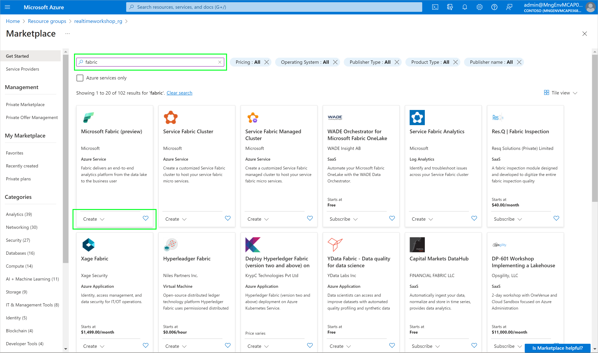
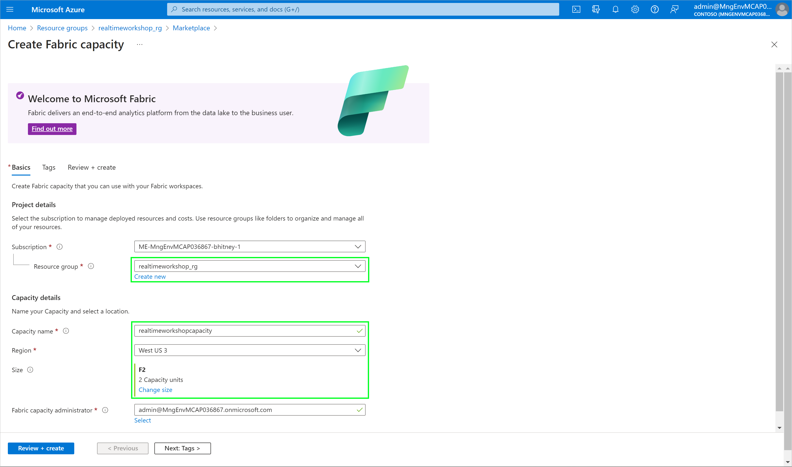
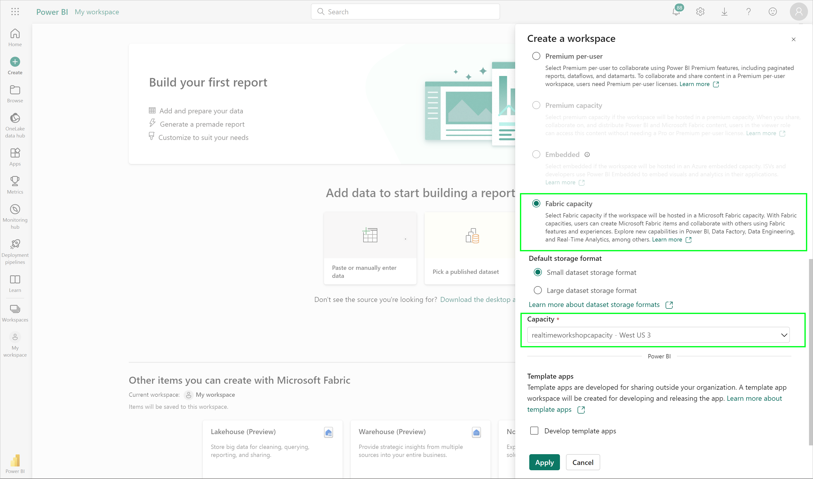
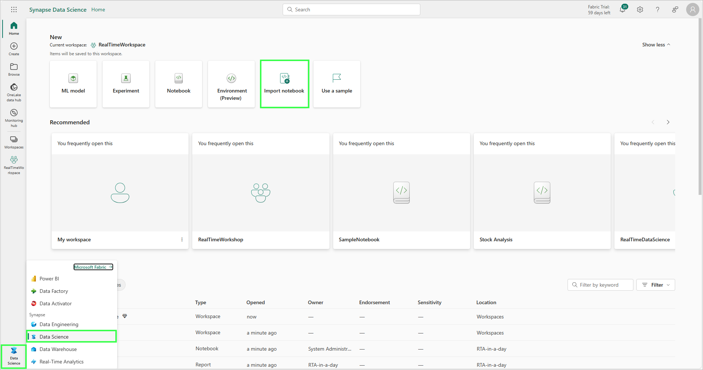
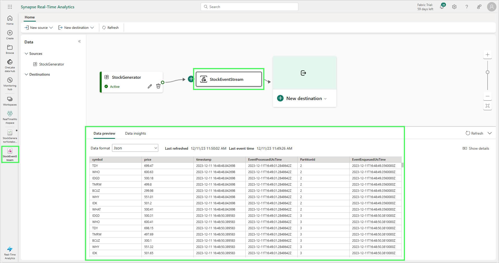
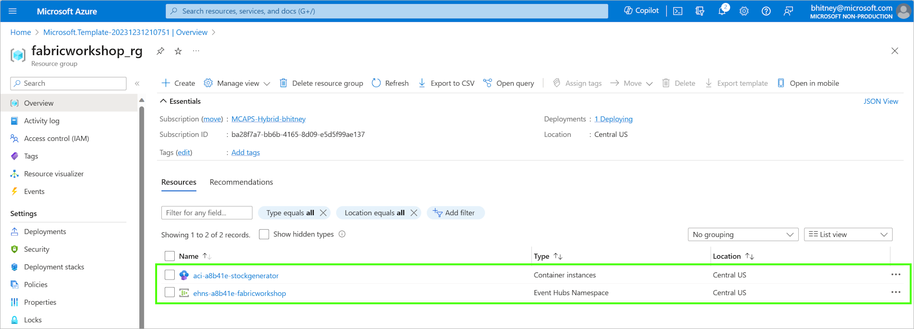
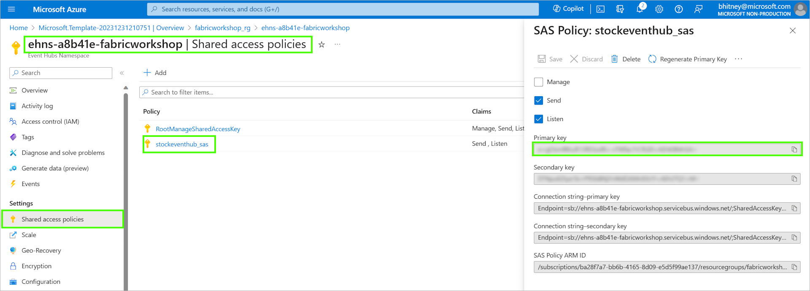
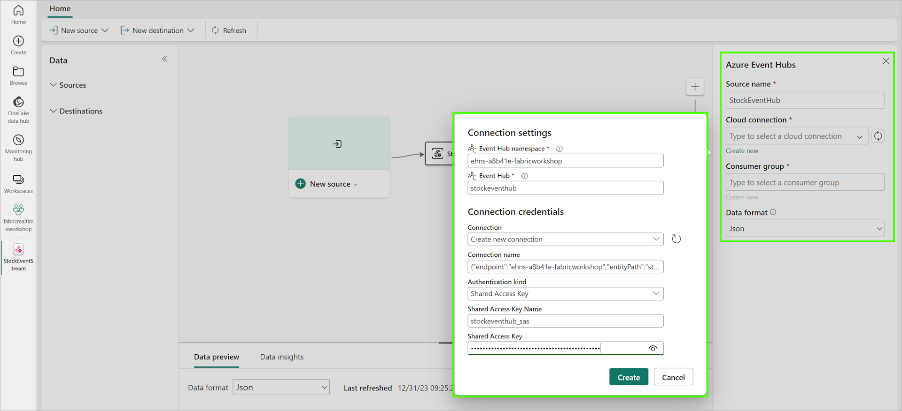

# Module 00 - Lab Environment Setup

**[Home](../README.md)** - [Next Module >](./module01.md)

## :stopwatch: Estimated Duration

30 minutes

## :thinking: Prerequisites

* Access to a Microsoft Fabric environment, or ability to create a Microsoft Fabric trial.

Depending on the deployment method, you may also need: 
* An [Azure account](https://azure.microsoft.com/free) with an active subscription.
* Owner permissions within a Resource Group to create resources and manage role assignments.

## :loudspeaker: Introduction

In order to follow along with the workshop exercises, we need to provision a set of resources. At the heart of the scenario is our real-time stock price generator script that generates a continuous stream of stock prices that we'll use throughout the workshop. There are two ways to deploy this application:

* Option 1 - Deploy the app via Jupyter notebook
* Option 2 - Deploy the app via Azure Container Instance

Both options yield the same results and is simply a matter of preference. For those using a Fabric free trial, we recommend using the Jupyter notebook (option 1) as it keeps the costs at zero, and gets you a bit more hands on with Fabric. The notebook must be kept running for the data to be generated. For those who have an existing environment (not a trial, and/or in a large organization) you may wish to go the container route (option 2) because running the script inside a container is more efficient than using a Spark cluster that the Jupyter notebook will use. (The pay-as-you-go cost for running the container and event hub is is roughly $1.70/day.) When deploying via a container, the container starts automatically and begins creating data immediately.

You always have the option to revisit this option later, should you wish to make a change.

We'll begin by creating our Fabric workspace, and then deploy the app using one of the methods mentioned above.

## Table of Contents

1. [Create Fabric Capacity and Workspace](#1-create-fabric-capacity-and-workspace)
2. [Option 1 - Deploy and run the app via Jupyter notebook](#2-option-1---deploy-the-app-via-jupyter-notebook)
3. [Option 2 - Deploy the app via Azure Container Instance](#3-option-2---deploy-the-app-via-azure-container-instance)

## 1. Create Fabric Capacity and Workspace

Microsoft Fabric is deployed to an Azure Active Directory tenant. Within each Fabric tenant, Fabric capacities can be created to group resources for various purposes -- this might be done organizationally (sales, marketing, development), geographically, or other logical grouping. 

If a Fabric Trial is available, we recommend taking advantage of that opportunity to try Microsoft Fabric for a period of time (currently 60 days) with no commitment.

To create a Fabric capacity outside of a trial environment, create a new resource from the Azure portal, and search for Fabric. 

On the Create Fabric capacity page, assign the capacity to a resource group in a region that is available to you or recommended by your proctor, and change the size to the smallest size to minimize costs.

To learn more about Fabric capacities, visit this page:
[https://learn.microsoft.com/en-us/fabric/enterprise/licenses](https://learn.microsoft.com/en-us/fabric/enterprise/licenses)

Next, we'll create the Workspace within our Fabric capacity. Workspaces are assigned to capacities and serve as logical groupings for collaboration. We'll create a workspace within Fabric to house all of the artifacts for this workshop. 

In the [Fabric portal](https://app.fabric.microsoft.com/), click on Workspaces in the left nav and create a new workspace called RealTimeWorkspace.

Be sure to assign the workspace to the capacity created above. To do this, expand the advanced settings and ensure Fabric capacity is selected as the licensing mode, with the capacity created above selected.

## 2. Option 1 - Deploy the app via Jupyter Notebook

This option deploys as a Jupyter notebook, generating our stock prices and publishing to an Eventstream within Fabric.

1. To begin, download the following notebook to a convenient location:

* [Download the Stock Generator notebook](../resources/module00/StockGeneratorNotebook.ipynb)

2. In your Fabric workspace, switch to the Real-Time Analytics persona (bottom left) and create a new Eventstream. Name the Eventstream StockEventStream.

3. On the Eventstream, configure a new source and select Custom App:

4. On the 'Keys' tab of the Custom App, reveal the first connection string and copy it to your clipboard:

5. Switch to the Data Science persona. On the home page for the persona, click 'Import Notebook' and upload the notebook you downloaded earlier:

6. In the notebook, paste the connection string from above in the single quotes of the 'ConnectionString' variable of the first cell. It should look similar to the below:

7. With the connection string in place, click 'Run All' in the top toolbar. The first few cells may take a few moments to start the Spark session and import the required libraries. After a few moments, switch back to the Eventstream to observe a preview of the events generated by the notebook:

With this step completed, we're ready to move on -- you can skip Option 2.

## 3. Option 2 - Deploy the app via Azure Container Instance

This option deploys the stock generator app to an Azure Container Instance using an ARM template. The app will generate stock data that publishes the data to an Azure Event Hub, which is also configured during the deployment of the ARM template. 

To auto-deploy the resources, use these steps below. 

1. `Right-click` or `Ctrl + click` the button below to open the Azure Portal in a new window.

    

2. Beneath the **Resource group** field, click **Create new** and provide a unique name (e.g. `realtimeworkshop`), select a valid location, and then click **Review + create**.

    Suggested Locations:

     * Australia East
     * Canada Central
     * Central India
     * Central US
     * East Asia
     * East US
     * East US 2
     * Germany West Central
     * Japan East
     * Korea Central
     * North Central US
     * Norway East
     * South Central US
     * Switzerland North
     * UAE North
     * West US
     * West US 3

3. Once the validation has passed, click **Create**.

4. After the deployment has completed, open the resource group and verify the Event Hub namespace and ACI machine is deployed: 

5. Open the EventHubNamespace, which will have a name similar to ehns-123456-fabricrealtime. On the Settings > Shared access policies page, take note of this event hub namespace name (such as ehns-123456-fabricrealtime), the event hub name (by default, fwtheventhub), the name of the SAS key (by default, RootManagedSharedAccessKey), and copy the primary key to your clipboard or safe location.

6. In your Fabric workspace, switch to the Real-Time Analytics persona (bottom left) and create a new Eventstream. Name the Eventstream StockEventStream.

7. On the Eventstream, configure a new source and select Event Hub:

8. On the Azure Event Hubs configuration page, add a new connection and using the values from event hub you noted earlier, specifying the $Default consumer group: 

## :tada: Summary

With the notebook or container generating data and ingesting into our Eventstream, we're ready to start processing the data!

## :white_check_mark: Results

- [x] Configured Fabric environment
- [x] Set up stock generator (notebook or ACI)
- [x] Data getting ingested into Fabric Eventstream

[Continue >](./module01.md)
