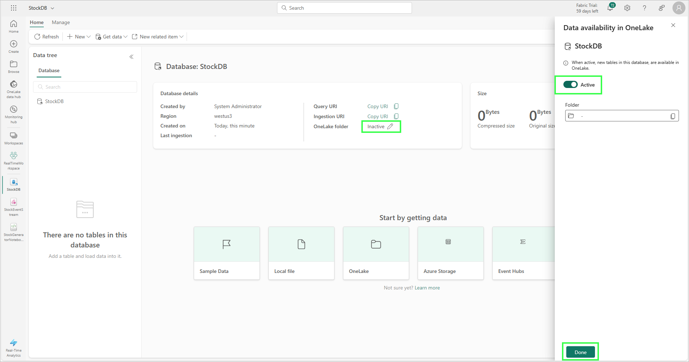
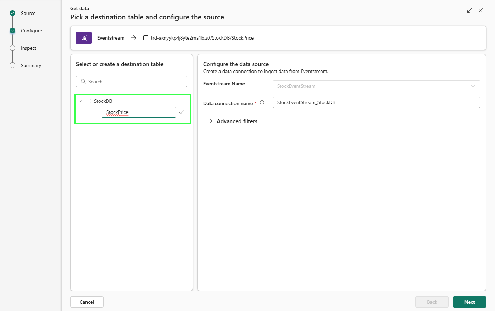

# Module 01 - KQL Database Configuration and Ingestion

[< Previous Module](../modules/module00.md) - **[Home](../README.md)** - [Next Module >](./module02.md)

## :stopwatch: Estimated Duration

30 minutes

## :thinking: Prerequisites

- [x] Lab environment deployed from [setup](../modules/module00.md)

## :loudspeaker: Introduction

With our environment setup complete, we will complete the ingestion of the eventstream so the data is ingested into a KQL database. This data will also be stored in Fabric OneLake. 

## Table of Contents

1. [Create KQL Database](#1-create-kql-database)
2. [Send data from the eventstream to the KQL database](#2-send-data-from-the-eventstream-to-the-kql-database)

## 1. Create KQL Database

Kusto Query Language (KQL) is the query language used by Real-Time analytics in Microsoft Fabric (along with several other solutions, like Azure Data Explorer, Log Analytics, Microsoft 365 Defender, and others). Similar to Structured Query Language (SQL), KQL is optimized for ad-hoc queries over big data, time series data, and data transformation. 

To work with the data, we'll create a KQL database and stream data from the Event Hub into the KQL DB. 

In the Fabric portal, switch to the Real-Time Analytics persona by using the persona icon in the bottom left. This helps contextualize the menus for the features most often used:

Select the RealTimeWorkspace on the left nav, then click New > KQL Database, and name it StockDB.

When the KQL is created, we should see the KQL details. An important setting for us to change immediately is enabling One Lake folders, which is inactive by default. Click on the pencil to change the setting and enable One Lake access:

After eanbling One Lake, you may need to refresh the page to verify the One Lake folder integration is active:

## 2. Send data from the eventstream to the KQL database

Navigate back to the eventstream created in the previous module. Our data should be arriving into our eventstream, and we'll now configure the data to be ingested into the KQL database we created above. On the eventstream, click on New destination and select KQL Database:

On the KQL Settings, 

## :tada: Summary

We have created and configured our Fabric environment, created a KQL database, and configured the database to ingest data from the Event Hub. 

## :white_check_mark: Results

- [x] Created the KQL Database

[Continue >](./module02.md)
