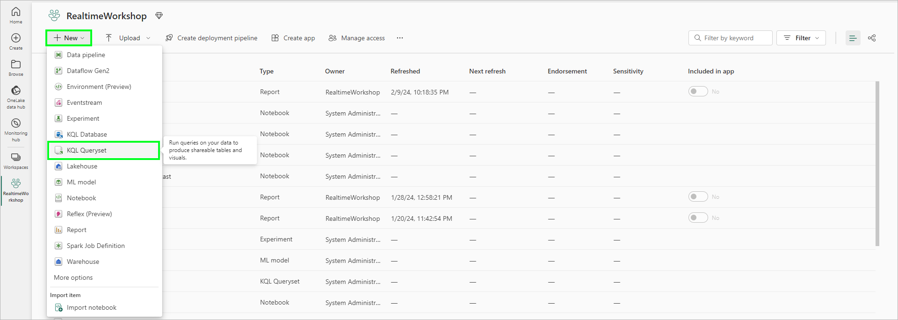
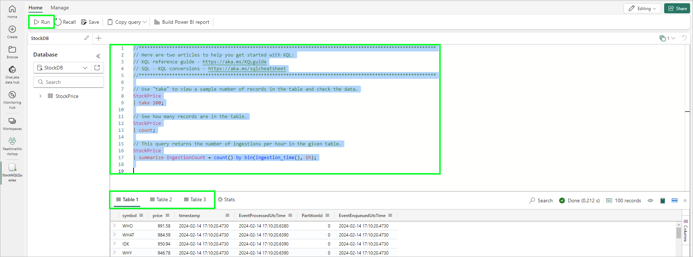
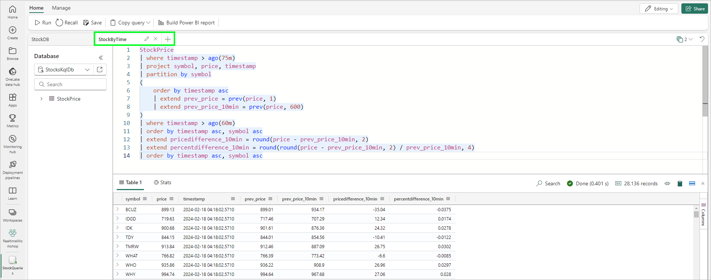

# Module 02 - Exploring the Data

[< Previous Module](./module01.md) - **[Home](../README.md)** - [Next Module >](./module03.md)

## :stopwatch: Estimated Duration

20 minutes

## :thinking: Prerequisites

- [x] Lab environment deployed from [setup](../modules/module00.md)
- [x] Completed [Module 01](../modules/module01.md)

## :loudspeaker: Introduction

Now that our data is streaming into our KQL database, we can begin to query and explore the data, leveraging KQL to gain insights into the data. A KQL Queryset is used to run queries, view, and transform data from a KQL database. Like other artifacts, a KQL Queryset exists within the context of a workspace. A queryset can contain multiple queries, each stored in a tab.

In this module, we'll create several KQL queries of increasing complexity to support different business uses.

Prefer video content? These videos illustrate the content in this module:
* [Getting Started with Real-time Analytics in Microsoft Fabric](https://youtu.be/wGox1lf0ve0)

## Table of Contents

1. [Create KQL Queryset: StockQueryset](#1-create-kql-queryset-stockbytime)
2. [Query recent prices](#2-query-recent-prices)
3. [Calculate biggest price changes and time change occurred](#3-calculate-biggest-price-changes-and-time-change-occurred)

## 1. Create KQL Queryset: StockQueryset

A KQL Queryset is used to run queries, view, and transform data from a KQL database. Like other artifacts, a KQL Queryset exists within the context of a workspace.

From your workspace, click *New* > *KQL Queryset*, and enter *StockQueryset* as the name. Select the *StockDB* from the list of available databases. The KQL query window will open, allowing us to query the data.



The default query code will look similar to the code below, and contains 3 distinct KQL queries. You may see *YOUR_TABLE_HERE* instead of the *StockPrice* table -- to try this query, replace the table name if necessary. We'll also add a semicolon at the end of each statement; this allows us to run multiple queries in one request:

```text
// Use "take" to view a sample number of records in the table and check the data.
StockPrice
| take 100;

// See how many records are in the table.
StockPrice
| count;

// This query returns the number of ingestions per hour in the given table.
StockPrice
| summarize IngestionCount = count() by bin(ingestion_time(), 1h);
```

To run a single query when there are multiple queries in the editor, you can highlight the query text or place your cursor so the cursor is in the context of the query (for example, at the beginning or end of the query) -- the current query should highlight in blue. To run the query, click *Run* in the toolbar. If you'd like to run all 3 to display the results in 3 different tables, each query will need to have a semicolon (;) after the statement, as shown below. Select all of the text, and click *Run*:  



## 2. New Query: StockByTime

Create a new tab within the queryset by clicking the *+* icon near the top of the window. Rename this tab to *StockByTime*.



We can begin to add our own calculations, such as calculating the change over time. For example, the [prev()](https://learn.microsoft.com/en-us/azure/data-explorer/kusto/query/prevfunction) function, a type of windowing function, allows us to look at values from previous rows; we can use this to calculate the change in price.

Try the following query and observe the results.

```text
StockPrice
| where timestamp > ago(60m)
| order by timestamp asc, symbol asc
| extend pricedifference = round(price - prev(price, 8), 2)
| extend percentdifference = round(round(price - prev(price, 8), 2) / prev(price, 8), 4)
| serialize previousprice = prev(price,8,0)
```

In this KQL query, the results are limited to rows within the last 60 minutes, which is sufficient for our real time dashboard.

The previous price is calculated by looking at the previous row of the same symbol (8 rows earlier). This requires the data is *serialized* so the order of the data is guaranteed, as required when using functions like *prev()* or *next()*. However, because we are using an *order by*, the data is automatically serialized so using the *serialize* keyword is not strictly required, but is a good idea for clarity.

## 3. New Query: StockAggregate

Create another new tab within the queryset by clicking the *+* icon near the top of the window. Rename this tab to *StockAggregate*.

This query will find the biggest price difference to find out the biggest price difference for each stock, and the time it occurred. 

 To do this, we can use the [summarize](https://learn.microsoft.com/en-us/azure/data-explorer/kusto/query/summarizeoperator) operator, which produces a table that aggregates the input table into groups based on the specified parameters. 

```text
 StockPrice
| order by timestamp asc, symbol asc
| extend pricedifference = round(price - prev(price, 8), 2)
| extend percentdifference = round(round(price - prev(price, 8), 2) / prev(price, 8), 4)
| summarize arg_max(pricedifference, timestamp, price) by symbol
```

## 3. New Query: StockBinned

Create another new tab within the queryset by clicking the *+* icon near the top of the window. Rename this tab to *StockBinned*.

KQL also has a *bin()* function, which can be used to bucket results based on the bin parameter -- in this case, by specifying a timestamp of 1 hour, the result is aggregated for each hour. The time period can be set to minute, hour, day, and so on. 

```text
StockPrice
| summarize avg(price), min(price), max(price) by bin(timestamp, 1h), symbol
| sort by timestamp asc, symbol asc
```

This is particularly useful when creating reports that aggregate real-time data over a longer time period.

## 3. New Query: StockWithAverages

Create another new tab within the queryset by clicking the *+* icon near the top of the window. Rename this tab to *StockWithAverages*.

In KQL, the *let* statement is used to assign a expression or value to a variable. This is useful for breaking up a complex expression, for readability, or for supporting subqueries. Copy the example below into the editor. To run, be sure to highlight all of the text (both queries), otherwise only one query will run. 

The first query calculates the average of the stocks over the last 1 hour, and assigns it to a variable called *AvgPrices*. Note that this time window, 1 hour, is configurable. 

The second query is intended for our real-time dashboard. Here, we grab the latest data (we use 15 minutes to constrain the results), and join this to the *AvgPrices*. We can then calculate whether our stock is moving up or down from its low, high, or average price. As you might imagine, we could expand this further to get views over multiple periods, such as 1 minute, 1 hour, and 1 day.

```text
let AvgPrices = 
StockPrice
| where timestamp > ago(1h)
| summarize 
    minperiodprice=arg_min(price,*), 
    maxperiodprice=arg_max(price,*),
    avgperiodprice=round(avg(price),2) by symbol
| project symbol, timestamp, avgperiodprice, minperiodprice, maxperiodprice;

StockPrice
| where timestamp > ago(15m)
| order by timestamp asc, symbol asc
| join kind=inner AvgPrices on symbol
| extend minperiodpercentdifference = round((price - minperiodprice) / minperiodprice, 4)
| extend maxperiodpercentdifference = round((price - maxperiodprice) / maxperiodprice, 4)
| extend avgperiodpercentdifference = round((price - avgperiodprice) / avgperiodprice, 4)
| project timestamp, symbol, price,
    minperiodprice, minperiodpercentdifference,
    maxperiodprice, maxperiodpercentdifference, 
    avgperiodprice, avgperiodpercentdifference
```

## :thinking: Tips

* Too much data? Consider adding a row limit filter, like 'take 1000', to limit the number of rows returned.

## :thinking: Additional Learning

* [KQL prev() function](https://learn.microsoft.com/en-us/azure/data-explorer/kusto/query/prevfunction)
* [KQL summarize operator](https://learn.microsoft.com/en-us/azure/data-explorer/kusto/query/summarizeoperator)
* [MS Learn: Query data in a KQL queryset](https://learn.microsoft.com/en-us/fabric/real-time-analytics/kusto-query-set)


While this query is quick and effective, there are other ways to approach aggregation and look-back. We'll revisit this in our add-ons in [the Extras](../modules/moduleex00.md) content. 


## :tada: Summary

In this exercise, you create several KQL Querysets to explore the data. Moreover, these Querysets will serve as filters and transformations of the data to feed into the reports we will create in the next module.

## :white_check_mark: Results

- [x] Queried the data using KQL

[Continue >](./module03.md)
