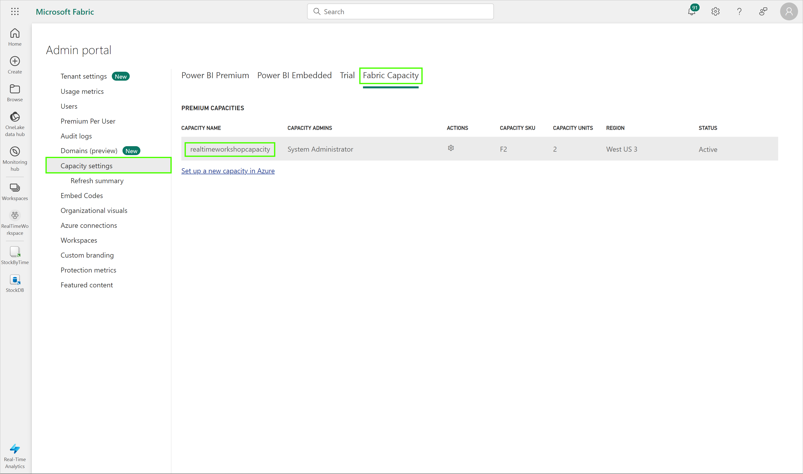

# Module 03 - Reporting

[< Previous Module](../modules/module02.md) - **[Home](../README.md)** - [Next Module >](./module04.md)

## :stopwatch: Estimated Duration

20 minutes

## :thinking: Prerequisites

- [x] Lab environment deployed from [setup](../modules/module00.md)
- [x] Completed [Module 01](../modules/module01.md)
- [x] Completed [Module 02](../modules/module02.md)

## :loudspeaker: Introduction

With the data loaded in the database and our inital KQL Queryset complete, we can begin to craft visualizations for real-time dashboards.

## Table of Contents

1. [Configure Refresh Rate](#1-configure-refresh-rate)
2. [Create a basic Power BI report](#2-create-a-basic-power-bi-report)

## 1. Configure Refresh Rate

Our Power BI tenant needs to be configured to allow for real time updating. To configure this setting, navigate to the Power BI admin portal by clicking on the settings icon in the upper right of the Fabric portal. 

Under capacity settings, select Fabric capacity and select the capacity name configured earlier.

On the following screen, scroll down to the Power BI workloads section, and under Datasets, configure Automatic page refresh to on, with a minimum refresh interval of 1 second. Click Apply. Note: depending on your administrative permissions, this setting may not be available.

## 2. Create a basic Power BI report

From the StockByTime queryset in the Fabric portal, click the Build Power BI report button above the query window.

On the report page that opens, we can configure our initial chart. Add a line chart to the design surface, and configure the report as follows:

* Legend: Stock Symbol
* X-axis: Timestamp
* Y-axis: Stock Price

Click File > Save, and name the report RealTimeStocks, and be sure to add it to the RealTimeWorkspace. It may take a few moments for the report to save and appear in the workspace.

Open the report from the RealTimeStocks workspace. While this is a promising start, let's make sure the chart only shows data for the last minute. Click the edit button to open the report editor, and select the line chart on the report. Configure the Timestamp filter to display data for the last 1 minute.

## 3. Create a second visual for percent change

Repeating the steps above, create a second line chart either beside or below the existing line chart. Instead of plotting the current stock price, select the percent changed value, which is a positive or negative value based on the previous price. Use these values for the chart:

* Legend: Stock Symbol
* X-axis: Timestamp
* Y-axis: Percent Changed

Similarly, configure the visual filter to show data only for the last minute. When complete, your visuals should look similar to the image below:

## 4. Configure the report to auto-refresh

Deselect the chart. On the Visualizations settings, configure page fresh to automatically refresh every second.

## :tada: Summary

In this module, you modified the Power BI admin settings to allow for frequent page refreshes. Next, you created a Power BI report that leveraged the KQL queryset created in the previous module. The line charts filtered the data for the last minute, and the page was configured to update every 1 second.

## :white_check_mark: Results

- [x] Created a Power BI real-time report.

[Continue >](./module04.md)