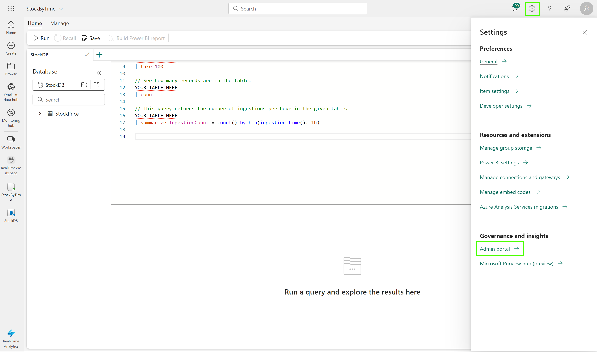
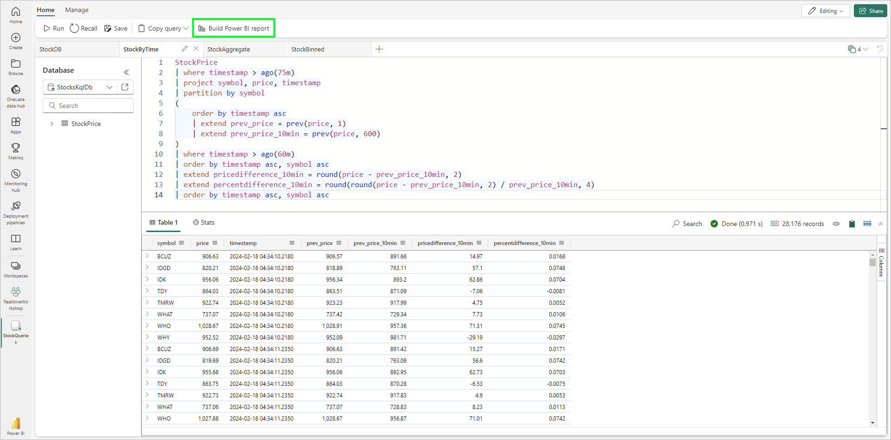

# Module 03 - Reporting

[< Previous Module](./module02.md) - **[Home](../README.md)** - [Next Module >](./module04.md)

## :stopwatch: Estimated Duration

20 minutes

## :thinking: Prerequisites

- [x] Lab environment deployed from [setup](../modules/module00.md)
- [x] Completed [Module 01](../modules/module01.md)
- [x] Completed [Module 02](../modules/module02.md)

## :loudspeaker: Introduction

With the data loaded in the database and our initial KQL Queryset complete, we can begin to craft visualizations for real-time dashboards.

## Table of Contents

1. [Configure Refresh Rate](#1-configure-refresh-rate)
2. [Create a basic Power BI report](#2-create-a-basic-power-bi-report)
3. [Create a second visual for percent change](#3-create-a-second-visual-for-percent-change)
4. [Configure the report to auto-refresh](#4-configure-the-report-to-auto-refresh)

## 1. Configure Refresh Rate

Our Power BI tenant needs to be configured to allow for real time updating. To configure this setting, navigate to the Power BI admin portal by clicking on the *Settings* icon in the upper right of the Fabric portal. 

Select *Capacity settings* on the left, and select the Fabric capacity that matches your current environment: this will be *Trial* if using a trial environment, or the capacity name configured earlier if using a new Fabric capacity. If you are using your organization's capacity, you may not have sufficient permissions to modify these settings, which means some functionality will be limited if the organization has limited the max refresh rate.

On the following screen, scroll down to the *Power BI workloads* section, and under *Semantic Models* (recently renamed from *Datasets*), configure *Automatic page refresh* to *On*, with a minimum refresh interval of 1 second. Click *Apply*. Note: depending on your administrative permissions, this setting may not be available. Note that this change may take several minutes to complete.

> :bulb: **Did you know?**
> Power BI Datasets have recently been renamed to Semantic Models. In some cases, labels may not have been updated. The terms can be used interchangeably. Read more about this change [on the Power BI Blog](https://powerbi.microsoft.com/en-us/blog/datasets-renamed-to-semantic-models/).

## 2. Create a basic Power BI report

From the *StockQueryset* Queryset used in the previous module, select the *StockByTime* query tab. Select the query and run to view the results. Click *Build Power BI report* button above the query window to bring this query into Power BI.

On the report preview page that opens, we can configure our initial chart. Don't worry about spacing and any fine details -- we'll open the report in the full editor in just a moment. Initially, add a line chart to the design surface, and configure the report as follows. See the image below as a reference.

* Legend: symbol
* X-axis: timestamp
* Y-axis: price

> :bulb: **Sum, or average?**
> You may notice the default aggregation for data is *sum*, such as *sum of price*. In the event there are multiple prices for a given symbol at the same point in time, this aggregation sets the behavior. *Sum* would, of course, add all prices, whereas *avg* would take the mean for all prices for that symbol at that point in time. Ideally, we should only have a single price for a symbol at a given point in time, so there should be no visible difference. Average would be more technically correct for our purposes. 

Click File > Save, name the report RealTimeStocks, and be sure to save it to the RealTimeWorkspace. 

Open the report from either the link on the save dialog or from the RealTimeStocks workspace. While this is a promising start, let's make sure the chart only shows data for the last 5 minutes. Click the edit button along the top navigation bar to open the report editor, and select the line chart on the report. Configure a filter for *timestamp* to display data for the last 5 minutes using these settings:

* Filter type: Relative time
* Show items when the value: is in the last 5 minutes

Click *Apply filter* to enable the filter. This should look similar to:

## 3. Create a second visual for percent change

Repeating the steps above, create a second line chart either beside or below the existing line chart. Instead of plotting the current stock price, select the *percentdifference_10min* value, which is a positive or negative value based off the difference between the current price and the value of the price from 10 minutes ago. Use these values for the chart:

* Legend: symbol
* X-axis: timestamp
* Y-axis: average of percentdifference_10min

Similarly, configure the visual filter to show data only for the last 5 minutes. Next, under the *Visualizations* section, add an additional visualization by selecting the icon with the magnifying glass. Under *Y-Axis Constant Line*, add a constant line with a default value of 0. This adds a dashed line to report, as shown below. This allows us to see if we're above or below the period average. If you'd like to, you can further customize the look of the chart and layout.

When complete, your visuals should look similar to the image below:

> :bulb: **Missing some data?**
> If you're a fast user, you might build this report before enough data has been collected to calculate 10 minute averages. If you are unsure, you can double check the KQL query to ensure it is correct, and verify there is at least 10 minutes of activity.

## 4. Configure the report to auto-refresh

Deselect the chart. On the *Visualizations* settings, enable *Page refresh* to automatically refresh every second or two, based on your preference. Of course, realistically we need to balance the performance implications of refresh frequency, user demand, and system resources.

## :tada: Summary

In this module, you modified the Power BI admin settings to allow for frequent page refreshes. Next, you created a Power BI report that leveraged the KQL Queryset created in the previous module. The line charts were configured to filtered the data for the last minute, and the page was configured to automatically refresh.

## :white_check_mark: Results

- [x] Created a Power BI real-time report.

[Continue >](./module04.md)