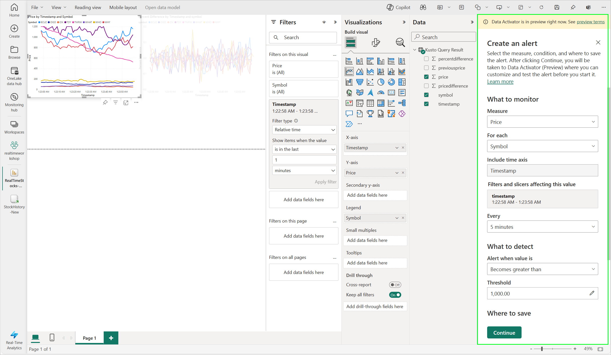
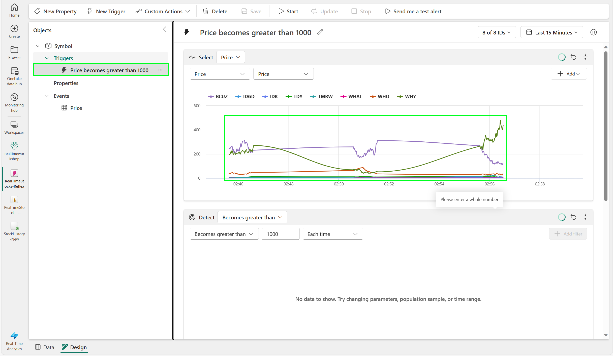
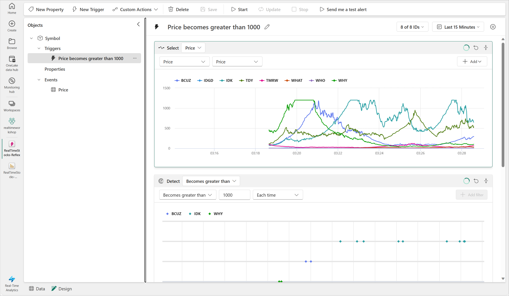
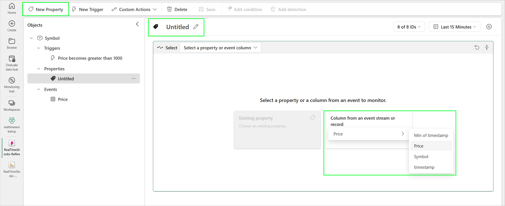
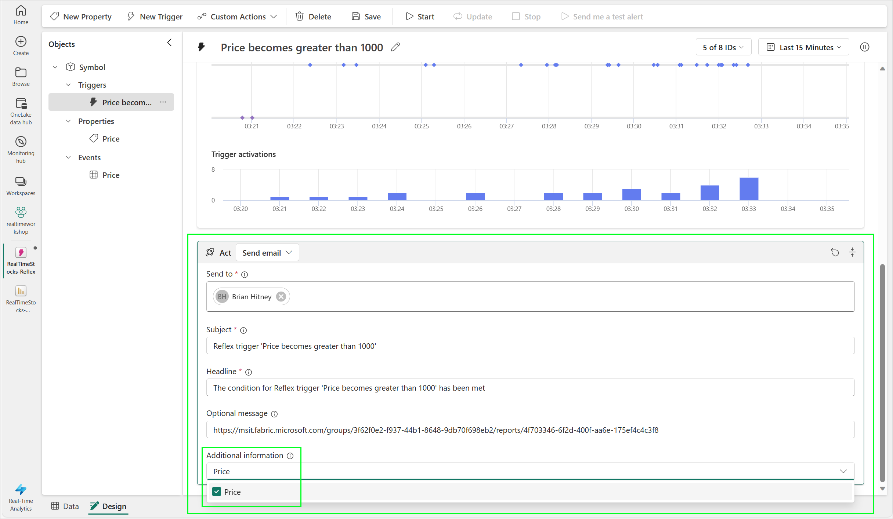
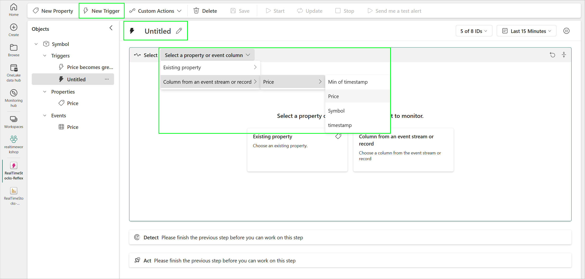
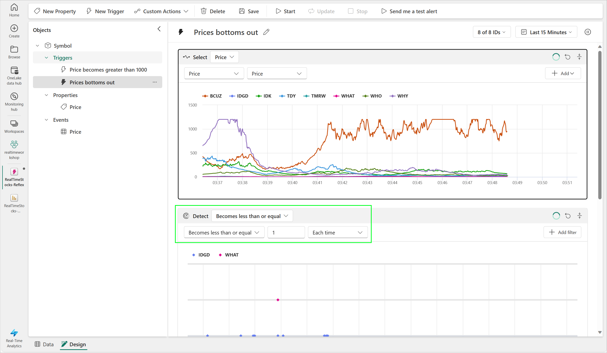

# Module 04 - Data Activator

[< Previous Module](../modules/module03.md) - **[Home](../README.md)** - [Next Module >](./module05a.md)

## :stopwatch: Estimated Duration

30 minutes

## :thinking: Prerequisites

- [x] Lab environment deployed from [setup](../modules/module00.md)
- [x] Completed [Module 01](../modules/module01.md)
- [x] Completed [Module 02](../modules/module02.md)
- [x] Completed [Module 03](../modules/module03.md)

## :loudspeaker: Introduction

Data Activator is an observability tool for automatically monitoring and taking actions when certain conditions (or patterns) are detected in a datastream. Common use cases include monitoring IoT devices, sales data, performance counters, and system health.

In this module, we'll start by linking the Power BI report monitoring the stock price created in [Module 03](../modules/module03.md) to Data Activator. Additional sub-modules will be added over time for additional scenarios, such as monitoring the Eventstream directly. In this configuration, data flows through the system like this:

```mermaid
flowchart LR
    A[Event Hub] --> B{Eventstream}
    B --> C[(KQL DB)]
    C --> D[PBI Report]
    D --> E{Data Activator}
```

Learn more about Data Activator on the [Microsoft Learn Data Activator](https://learn.microsoft.com/en-us/fabric/data-activator/data-activator-introduction) page. 

> :bulb: **Did you know?**
> Data Activator is currently in *public preview*. This module will be updated over time, and some features are subject to change. 
>
> Currently, Data Activator can consume data from Power BI and Eventstreams (such as Azure Event Hub, Kafka). In the future, additional sources (like KQL querysets) and more advanced triggering will be added. Read the [Data Activator roadmap](https://learn.microsoft.com/en-us/fabric/release-plan/data-activator) for more information.

## Table of Contents

1. [Prepare the report](#1-prepare-the-report)
2. [Create the trigger](#2-create-the-trigger)
3. [Configure the reflex](#3-configure-the-reflex)
4. [Add a property](#4-add-a-property)
5. [Configure and start trigger](#5-configure-and-start-trigger)
6. [Configure a new trigger for low price detection](#6-configure-a-new-trigger-for-low-price-detection)
7. [Optional: Configure a new Reflex for Pecent Changed](#7-optional-configure-a-new-reflex-for-percent-changed)

## 1. Prepare the report

Before we configure Data Activator, we'll clean up the report created in [Module 03](../modules/module03.md), as these labels will be imported into Data Activator and modifying them now will make the Data Activator *reflex* more readable. A Data Activator Reflex is the container that holds all of the information needed about the data connection, the events, and triggers.

While modifying the report, it's usually best to disable auto-refresh temporarily (see [Module 03](../modules/module03.md) for information on configuring this setting). 

For each report, modify the labels for each visual by renaming them. Rename them similar to:

* *sum of price* to *Price*
* *timestamp* to *Timestamp*
* *symbol* to *Symbol*
* *sum of percentdifference* to *Percent Difference*

When complete, it should look similar to:

## 2. Create the trigger

We'll configure Data Activator to alert when the value of the stock exceeds 1000 or is at/below 1. 

Creating a new Data Activator Reflex for Power BI visuals is done directly within Power BI. On the *more options* ellipses in the corner of the visual, select *Trigger action*.

The *Create an alert* panel will open. The *Measure* allows us to configure what value to monitor (select Price), and *For each* allows us to monitor each symbol. The *Include time axis* is automatically selected as the timestamp is on the x-axis. 

> :bulb: **Did you know?**
> Data Activator currently works best on visuals that contain a time-axis, like we have in the line chart. It's possible to configure Data Activator on a number of visuals -- read more on [Data Activator and Power BI limitations here](https://learn.microsoft.com/en-us/fabric/data-activator/data-activator-limitations). For visuals without a time-axis, consider modifying the semantic model's refresh rate to match the polling frequency of the Reflex (at the present time, the fastest refresh rate of a semantic model is 15 minutes).

Set the monitoring to *Every 5 minutes*, and configure the alert to detect then the value *Becomes greater than* 1000. Save the reflex in the workspace with a name like *RealTimeStocks-Reflex*.

The screen should look similar to:

A pop up will ask you if you would like to start the trigger -- we'll do that in a moment, so close this dialog.

## 3. Configure the reflex

Open the reflex from the workspace. There are two modes to work with, switchable on the bottom of the reflex: *Data* and *Design*. Data allows us to look at the incoming data stream, and Design allows us to configure the reflex. When working with Power BI visuals, we'll primarily work in design mode. 

Each reflex object is given a name based on the measure we are monitoring. The name of the object is *Symbol* as we're monitoring every stock symbol in the event stream. The event we are monitoring is *Price*, so it is listed under Events. The trigger we initially created will trigger when the price becomes over 1000.

Click on the Trigger *Price becomes over 1000*. After a few minutes, you may notice the screen look similar to the below:

You may notice that there are 'spurts' of data for 1 minute, then 4 minutes where there is no data, and then repeats. This is because our visual is configured to only display 1 minute of information, while the reflex will poll every 5 minutes. To fix this, the visual in the Power BI report needs to contain at least 5 minutes of information, and then the Reflex needs to be created.

> :bulb: **Did you know?**
> Data Activator will eventually be able to support KQL queries directly -- so if we'd like more control over the event stream feeding Activator, we'll be able to feed Activator with the KQL results directly. We can also connect Activator to our Event Hub.

With our 5 minute data in Power BI, the Reflex now looks like the image below, with no gaps in the data stream.

## 4. Add a property

Adding properties to our reflex object allows them to be referenced in the notification. Add a *Price* property by clicking *New Property*, and selecting the Price from the event stream. Rename the property to Price.

## 5. Configure and start trigger

The last step is to configure the notification used when the trigger is set. In this case, we'll keep it to a basic e-mail trigger, but optionally can be a Teams message or a custom action in Power Automate, allowing the Reflex to plug directly into any solution. 

Under *Additional Information*, select the *Price* property. The price will then be included in the notification:

You can then start the trigger or send a test notification. If the trigger is started, Activator will look at the data every 5 minutes, and trigger as appropriate. In this example, we configured an arbitrary value like 1000 -- a value that has a reasonably high chance of being triggered within a short lab duration. This can be modified based on the situation.

An email notification will look similar to:

## 6. Configure a new trigger for low price detection

Finally, we'll create a trigger for a low price event. By default, the stock can bottom out at 1. Create a new trigger, and select the price from the event stream:

This time, configure the trigger so it is set each time the price becomes less than or equal to 1:

Notice that on each trigger page, information about when and which symbol created the trigger is logged, to give you an idea as to how many triggers were created. This is useful for monitoring the activity.

## 7. Optional: Configure a new Reflex for Percent Changed

(Optional) Using steps similar to above, configure a new Data Activator Reflex (or, a new object can be added to this Reflex) that monitors the the Percentage Difference visual. Be sure to change its window to 5 minutes to ensure all events are routed into Data Activator.

## :thinking: Additional Learning

* [Microsoft Learn - Data Activator](https://learn.microsoft.com/en-us/fabric/data-activator/data-activator-introduction)
* [Data Activator roadmap](https://learn.microsoft.com/en-us/fabric/release-plan/data-activator)

## :tada: Summary

In this module, you learned how Data Activator works and how data is fed from Power BI visuals. You created two triggers, to test for high and low price conditions.

## :white_check_mark: Results

- [x] Created Data Activator Reflex
- [x] Configured multiple triggers

[Continue >](./module05a.md)