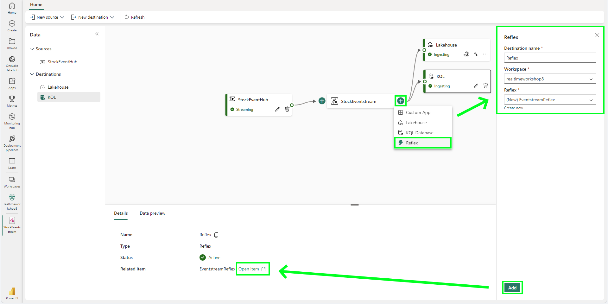
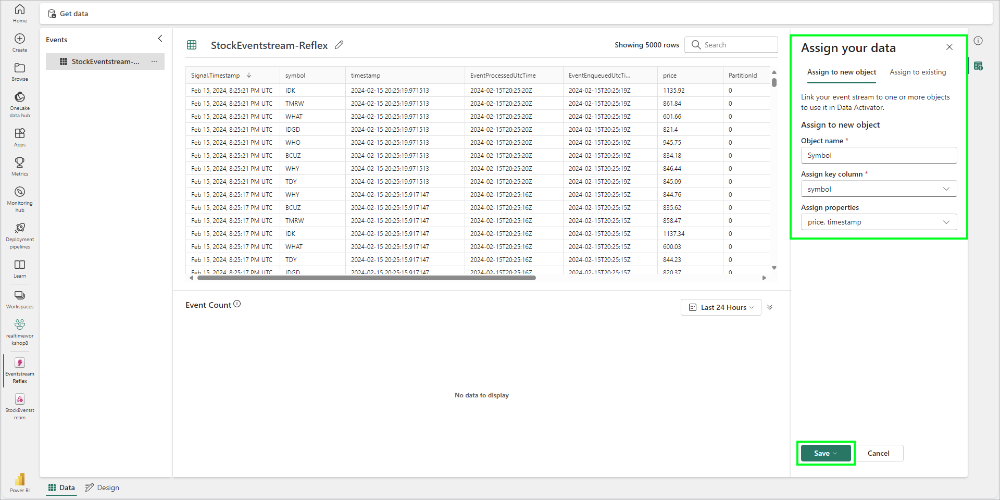
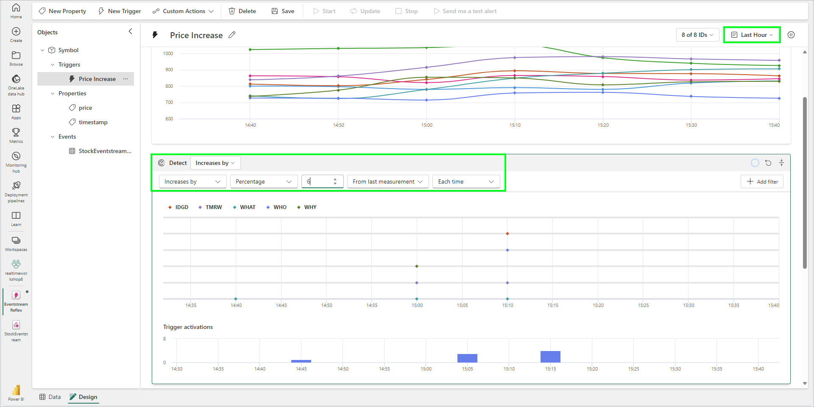
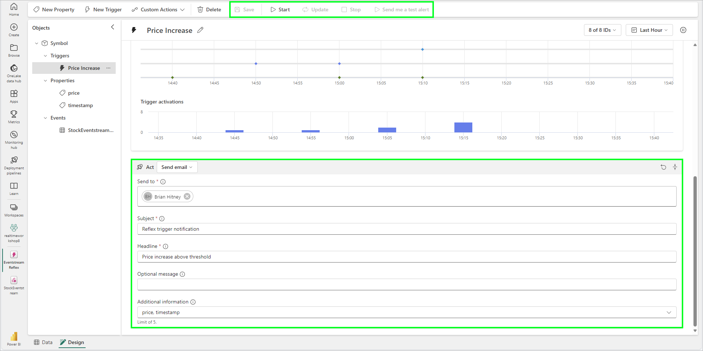
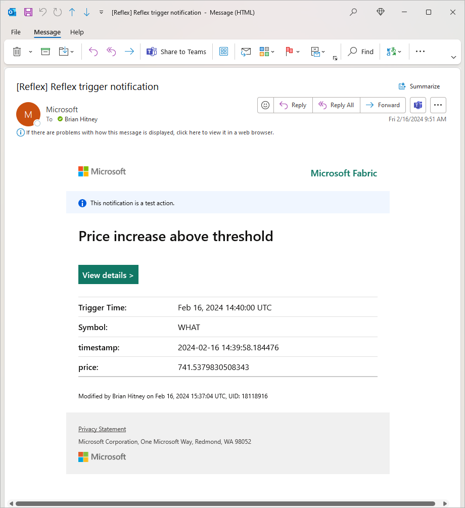
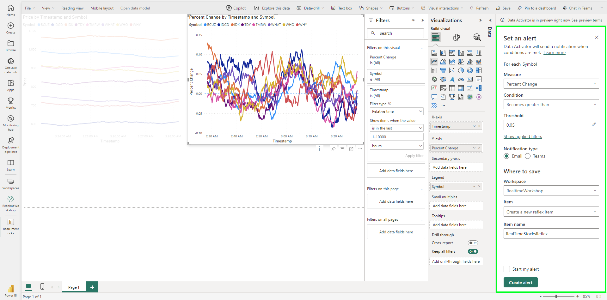
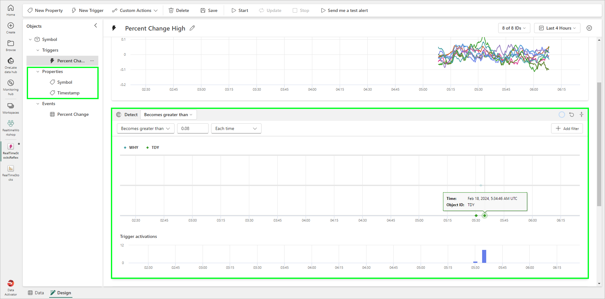
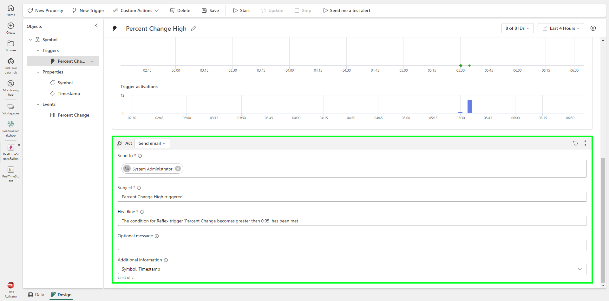

# Module 04 - Data Activator

[< Previous Module](./module03.md) - **[Home](../README.md)** - [Next Module >](./module05a.md)

## :stopwatch: Estimated Duration

30 minutes

## :thinking: Prerequisites

- [x] Lab environment deployed from [setup](../modules/module00.md)
- [x] Completed [Module 01](../modules/module01.md)
- [x] Completed [Module 02](../modules/module02.md)
- [x] Completed [Module 03](../modules/module03.md)

## :loudspeaker: Introduction

> :bulb: **Did you know?**
> Data Activator is currently in *public preview*. This module will be updated over time, and some features are subject to change. 

Data Activator is an observability tool for automatically monitoring and taking actions when certain conditions (or patterns) are detected in a datastream. Common use cases include monitoring IoT devices, sales data, performance counters, and system health. Actions are typically notifications (such as e-mails or Teams messages) but can also be customized to launch Power Automate workflows, for example.

Currently, Data Activator can consume data from Power BI and Fabric Eventstreams (such as Azure Event Hubs, Kafka, etc.). In the future, additional sources (like KQL querysets) and more advanced triggering will be added. Read the [Data Activator roadmap](https://learn.microsoft.com/en-us/fabric/release-plan/data-activator) for more information.

In this module, we'll use Data Activator to monitor both Eventstreams and Power BI reports. When we configure Data Activator, we set up one or more *Reflexes*. A Data Activator Reflex is the container that holds all of the information needed about the data connection, the events, and triggers.

Learn more about Data Activator on the [Microsoft Learn Data Activator](https://learn.microsoft.com/en-us/fabric/data-activator/data-activator-introduction) page. 

Prefer video content? This videos illustrate the content in this module:
* [Getting Started with Data Activator in Microsoft Fabric](https://youtu.be/3DjLJLiwkC0)

## Table of Contents

1. [Using Data Activator with an Eventstream](#1-using-data-activator-with-an-eventstream)
    1. [Configure the Eventstream](#1-1-configure-the-eventstream)
    2. [Configure the object](#1-2-configure-the-object)
    3. [Configure the properties](#1-3-configure-the-properties)
    4. [Configure the trigger](#1-4-configure-the-trigger)
    5. [Additional challenges](#1-5-additional-challenges)
    6. [Cleanup and conclusion](#1-6-cleanup-and-conclusion)
2. [Using Data Activator in Power BI](#2-using-data-activator-in-power-bi)
    1. [Prepare the report](#2-1-prepare-the-report)
    2. [Create the trigger](#2-2-create-the-trigger)
    3. [Configure the Reflex](#2-3-configure-the-reflex)
    4. [Configure the notification](#2-4-configure-the-notification)
7. [Optional: Configure new Reflexes](#7-optional-configure-new-reflexes)

## 1. Using Data Activator with an Eventstream

In this step, we'll configure Data Activator to detect a large increase in price of a stock symbol and send a notification.

When using Data Activator with Eventstreams, our data flow will look like the below diagram. The benefit of this approach is that the number of steps required between source (Event Hub) and trigger (Data Activator) is minimized:

```mermaid
flowchart LR
    A[Event Hub] --> B{Eventstream}
    B --> E{Data Activator}
```

### 1-1. Configure the Eventstream

Open the *StockEventstream*. Add a new output by clicking the + (plus) symbol on the StockEventstream object, and select *Reflex*. 

Configure the Reflex as follows and then click *Add*:

* Destination name: Reflex
* Workspace: RealTimeWorkspace (or the name of your workspace)
* Create a new Reflex named EventstreamReflex

After the Reflex is added, open the Reflex by clicking the *Open item* link at the bottom of the page.

### 1-2. Configure the object

When the Reflex is created, we'll need to add a new object. An object represents the item we are observing -- for example, freezers, packages, or in this case, stock prices (symbols). When first opened, the *Assign your data* panel will be visible:

Enter the following in the *Assign your data* pane and click *Save*:

* Object name: Symbol
* Assign key column: symbol
* Assign properties: price, timestamp

### 1-3. Configure the properties

Once saved, the Reflex will load. Select the *price* property. This will load a view of the price property for each symbol as the events are coming in. In the *Add* dropdown on the right of the price window, select *Summarize* > *Average over time*:

Configure the *Average over time* to 10 minutes. In the upper right, set the time window to the *Last Hour*, as shown below. This step averages the data over 10 minute blocks: this will help in finding larger swings in price:

### 1-4. Configure the trigger

The next step is to add a new trigger. In the top navigation bar, click the *New Trigger* button. When the new trigger page loads, change the name of the trigger to *Price Increase* and select the price as the property to monitor, as shown below.

Verify (and change if needed) the time window in the upper right is set to *Last Hour*. Notice that the *price* chart should retain the summarized view, averaging data in 10 minute intervals. In the *Detect* section, configure the type of detection to *Numeric* > *Increases by*. Set the type of increase to *Percentage*. Start with a value of about 5%, but you will need to modify this depending on the volatility of your data. Set this value to *From last measurement* and *Each time*, as shown below:

For the purposes of visualizing the detections, set the value low enough so you have some detections, but not so many that it is overwhelming. In the example above, with the value set to 6%, there is 1 detection at 14:45, 3 at 15:05, and 4 at 15:15. While we'd probably want to increase this even further, this serves the purpose for demonstrating how Data Activator detects changes.

Next, configure the *Action* to send an e-mail. If you are in a corporate or owned environment, you should be able to use your e-mail address. If you are in a sandbox lab environment, sending an e-mail will likely not be possible. However, when sending a test e-mail, the message is *always* sent to your (the logged in user) e-mail address, regardless of what is specified in the e-mail field. External recipients outside of the organization are not permitted.

Finally, be sure to add the *price* and *timestamp* to the *Additional information* box. When complete, save the trigger by clicking *Save* on the top navigation bar. The *Send me a test alert* button should become enabled, you can use this to send a test notification if your environment allows:

An e-mail notification looks similar to the following:

### 1-5. Additional challenges

Consider additional filters for conditions like price decreases, number of detections, and so-on. Experiment.

### 1-6. Cleanup and conclusion

Because most participants in this workshop will be in a lab environment that won't allow notifications, when completed, delete the Eventstream-Reflex output from the StockEventStream and, if desired, delete the Eventstream-Reflex from the workspace.

While using Eventstreams in Data Activator is a direct and convenient way to issue notifications, flexibility is limited. For example, what if we only wanted to trigger if the stock price is a percent higher or lower than the previous day's closing price? Or rising faster than the average of all stocks? These conditions are typically answered in a report, so we'll look at how to do this in Power BI next.

> :bulb: **Short on time?**
> If you're satisfied with your understanding of Data Activator and would like to move ahead, this is a good opportunity to skip to the next module. The steps below are similar, using a Power BI report to trigger notifications instead of an Eventstream.

## 2. Using Data Activator in Power BI

In this step, we'll create a Data Activator Reflex based off a Power BI report. The advantage in this approach is the ability to trigger off of more conditions. Naturally, this might include data from the Eventstream, loaded from other data sources, augmented with DAX expressions, and so forth. One current limitation (which may change as Data Activator matures): Data Activator monitors Power BI reports for data every hour. This may introduce an unacceptable delay, depending on the nature of the data.

In this example, we'll use our previously created Power BI report, which is powered by a KQL query. Our flow will resemble this diagram:

```mermaid
flowchart LR
    A[Event Hub] --> B{Eventstream}
    B --> C[(KQL DB)]
    C --> D[PBI Report]
    D --> E{Data Activator}
```

### 2-1. Prepare the report

Before we configure Data Activator, we'll clean up the report created in [Module 03](../modules/module03.md), as these labels will be imported into Data Activator and modifying them now will make the Data Activator *Reflex* more readable. As a reminder, a Data Activator reflex is the container that holds all of the information needed about the data connection, the events, and triggers.

While modifying the report, it's best to disable auto-refresh temporarily (see [Module 03](../modules/module03.md) for information on configuring this setting). 

For each report, modify the labels for each visual by renaming them. While renaming them obviously makes the report more readable in Power BI, this will also make them more readable in Data Activator. You can rename them by selecting the drop-down on each field, selecting *Rename for this visual*. Rename them similar to:

* *sum of price* to *Price*
* *timestamp* to *Timestamp* (on both reports)
* *symbol* to *Symbol* (on both reports)
* *avg of percentdifference_10min* to *Percent Change*

Finally, we'll need to temporarily remove the Timestamp filter (set to display only the most recent 5 minutes) by clicking the *Clear filter* button on the filter. This is because Data Activator will pull report data once every hour; when the Reflex is configured, filters are also applied to the configuration. We want to make sure there's at least an hour of data for the Reflex; the filter can be added back after the Reflex is configured. We'll include an example below of what happens when this isn't the case.

When complete, it should look similar to:

### 2-2. Create the trigger

We'll configure Data Activator to trigger an alert when the Percent Change value moves above a certain threshold (likely around 0.05). To create a new Reflex and trigger, click on the ellipsis in the corner of the visual for *More options*, and click *Set alert*.

In the side *Set an alert* window, most settings will be pre-selected. Use the following settings:

* Measure: Percent Change
* Condition: Becomes greater than
* Threshold: 0.05 (this will be changed later)
* Filters: verify there are no filters affecting the visual
* Notification type: Email

Under *Where to save*, use the following settings:
* Workspace: RealTimeWorkspace (or the name of your workspace)
* Item: Create a new reflex item
* Item name: RealTimeStocksReflex

This will look similar to:

Uncheck *Start my alert* and click *Create alert*. After the Reflex is saved, the notification should include a link to edit the Reflex -- click the link to open the Reflex. The Reflex can also be opened from the workspace items list.

### 2-3. Configure the Reflex

The Reflex should open on the trigger, named *Percent Change becomes greater than 0.05*. Click the pencil icon on the title and change the title to *Percent Change High*. Using the drop down in the upper right, change the window to display data within the last 4 hours. Also, be sure to select all stock symbols to display (labelled as IDs) -- the initial visual may only show a few of the stock symbols:

Next, add two properties for Symbol and Timestamp. Click *New Property* in the upper left, and select both Symbol and Timestamp from the *Select a property of event column* drop down, as shown below. Change the name of each property to *Symbol* and *Timestamp*.

Click on the Percent Change High trigger under the Objects > Triggers list. The top window will show data for the past 4 hours, and will be updated every hour. The second window defines the detection threshold. You may need to modify this value to make it either more or less restrictive. Increasing the value will reduce the number of detections -- change this value so there are a few detections, similar to the image below. The specific values will change slightly with your data volatility:

If you happen to have your Reflex running for several hours and notice that graphs tend to look like the image below, it means there was not enough data on the visual when the Reflex received the data. The visual will have to have enough data to cover the 1 hour window between polling.

### 2-4. Configure the notification

Finally, configure the *Act* to send an message, as done in the previous Reflex. Alter the subject, headline, and add properties to the *Additional information* input. 

Finally, if your environment allows, you can send a test alert by clicking the *Send me a test alert* button. If you are in a corporate or owned environment, you should be able to use your e-mail address. If you are in a sandbox lab environment, sending an e-mail will likely not be possible. However, when sending a test e-mail, the message is *always* sent to your (the logged in user) e-mail address, regardless of what is specified in the e-mail field. External recipients outside of the organization are not permitted.

## 7. Optional: Configure new Reflexes

(Optional) Using steps similar to the above, configure new triggers based on different report elements. If you are doing additional lab modules, consider revising this step when you've completed the lakehouse and data science modules -- a trigger on predicted prices would be an interesting Reflex to configure!

## :thinking: Additional Learning

* [Microsoft Learn - Data Activator](https://learn.microsoft.com/en-us/fabric/data-activator/data-activator-introduction)
* [Data Activator roadmap](https://learn.microsoft.com/en-us/fabric/release-plan/data-activator)

## :tada: Summary

In this module, you learned how Data Activator works and how data is fed from Power BI visuals. You created two triggers, to test for high and low price conditions.

## :white_check_mark: Results

- [x] Created Data Activator Reflex
- [x] Configured multiple triggers

[Continue >](./module05a.md)