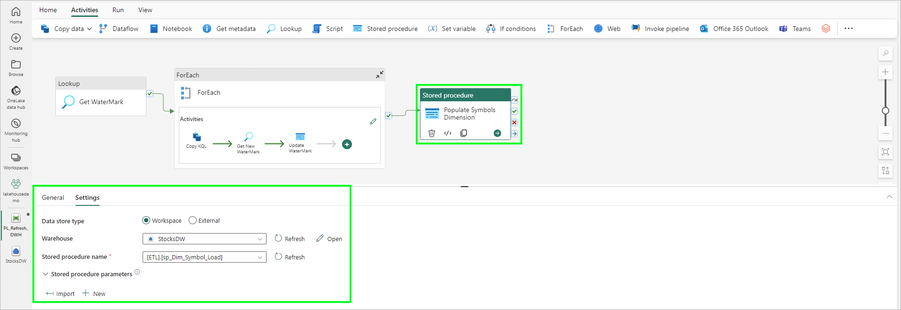
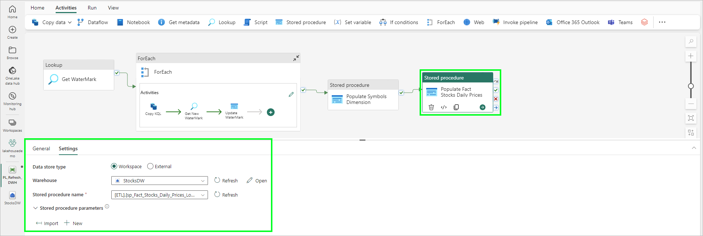

# Module 05b - Data Warehousing

[< Previous Module](../modules/module05a.md) - **[Home](../README.md)** - [Next Module >](./module05c.md)

## :stopwatch: Estimated Duration

* 45 minutes for 05b
* 120 minutes overall

## :thinking: Prerequisites

- [x] Completed [Module 05a](../modules/module05a.md)

## :loudspeaker: Introduction

With the completion of Module 05a, we have the plumbing in place to ingest data from the KQL database into our data warehouse. The next step is to prep the dimension tables. 

For the date dimension, we'll load this during this module with values for the foreseeable future. 

For the symbol dimension, we'll run that during the pipeline -- this way, if new stocks are added at some point, they will get added to the Symbol dimension table during the execution of the pipeline.

We'll also create views to support the pipeline by making it easier to load data from the staging table by aggregating the min, max, and closing price of the stock.

## Table of Contents

1. [Create the dimension and fact tables](#1-create-the-dimension-and-fact-tables)
2. [Load the date dimension](#2-load-the-date-dimension)
3. [Create the procedure to load the Symbol dimension](#3-create-the-procedure-to-load-the-symbol-dimension)
4. [Create the views](#4-create-the-views)
5. [Add activity to load symbols](#5-add-activity-to-load-symbols)
6. [Create the procedure to load daily prices](#6-create-the-procedure-to-load-daily-prices)


## 1. Create the dimension and fact tables

In our data warehouse, run the following SQL to create our fact and dimension tables. As in the previous step, you can run this ad-hoc or create a SQL query to save the query for future use.

```sql
-- Dimensions and Facts (dbo)
CREATE TABLE dbo.fact_Stocks_Daily_Prices
(
   StocksDailyPrice_SK INT NOT NULL
   ,Symbol_SK INT NOT NULL
   ,PriceDateKey DATE NOT NULL
   ,MinPrice FLOAT NOT NULL
   ,MaxPrice FLOAT NOT NULL
   ,ClosePrice FLOAT NOT NULL
)
GO

CREATE TABLE dbo.dim_Symbol
(
    Symbol_SK INT NOT NULL
    ,Symbol VARCHAR(5) NOT NULL
    ,Name VARCHAR(25)
    ,Market VARCHAR(15)
)
GO

CREATE TABLE dbo.dim_Date
(
    DateKey DATE NOT NULL
    ,DayOfMonth VARCHAR(2)
    ,MonthName VARCHAR(20)
    ,Year VARCHAR(4)    
)
GO
```

## 2. Load the date dimension

The date dimension is differentiated in that it can be loaded once with all of the values we'd need. Run the following script, which creates a procedure to populate the date dimension table with a large range of values. 

```sql
CREATE PROC [ETL].[sp_Dim_Date_Load]
@BeginDate DATE  = NULL
,@EndDate DATE = NULL
AS
BEGIN
SELECT @BeginDate  = ISNULL(@BeginDate, DATEADD ( DAY , 1 , EOMONTH ( GETDATE ( ) , - 2 ) ))
SELECT @EndDate = ISNULL(@EndDate,EOMONTH ( GETDATE ( ) , 1 ))
DECLARE @NumberOfDates INT = Datediff(day,@BeginDate, @EndDate)
--select @NumberOfDates

WHILE @NumberOfDates > 0 
BEGIN
    INSERT INTO [dbo].[dim_Date]
    SELECT DateKey
    ,Datepart(dd,DateKey) as DayOfMonth
    ,FORMAT(DateKey, 'MMMM') as MonthName
    ,Year(DateKey) as [Year]
    FROM 
    (SELECT DateKey = dateadd(d,@NumberOfDates, @BeginDate)
    ) Dates

    SET @NumberOfDates = @NumberOfDates - 1
END
END
GO
```

From a new query window, execute the above procedure by running the following script:

```sql
Exec ETL.sp_Dim_Date_Load
```

## 3. Create the procedure to load the Symbol dimension

Similar to the date dimension, each stock symbol corresponds to a row in the Symbols dimension table. This table would hold details of the stock, such as company name, or the market the stock is listed with.

Run the script below -- this will create the procedure that will load the stock symbol dimension. We'll execute this with the pipeline to handle any new stocks that might enter the feed.

```sql
CREATE PROC [ETL].[sp_Dim_Symbol_Load]
AS
BEGIN

DECLARE @MaxSK INT = (SELECT ISNULL(MAX(Symbol_SK),0) + 1 FROM [dbo].[dim_Symbol])

INSERT [dbo].[dim_Symbol]
SELECT  
    Symbol_SK = @MaxSK + ROW_NUMBER() OVER(ORDER BY Symbol)  
    , Symbol
    , Name
    ,Market
FROM 
    (SELECT DISTINCT
    sdp.Symbol 
    , Name  = 'Stock ' + sdp.Symbol 
    , Market = CASE SUBSTRING(Symbol,1,1)
                    WHEN 'B' THEN 'NASDAQ'
                    WHEN 'W' THEN 'NASDAQ'
                    WHEN 'I' THEN 'EURONEXT'
                    WHEN 'T' THEN 'NYSE'
                    ELSE 'No Market'
                END
    FROM 
        [stg].[vw_StocksDailyPrices] sdp
    WHERE 
        sdp.Symbol NOT IN (SELECT Symbol FROM [dbo].[dim_Symbol])
    ) stg

END
GO
```

## 4. Create the views

Next, we'll create the views that support the aggregation of the data during the load. When the pipeline runs, it copies the data from the KQL database into our staging table, where we'll collapse all of the data for each stock into a min, max, and closing price for each day. 

```sql
CREATE VIEW [stg].[vw_StocksDailyPrices] 
AS 
SELECT 
    Symbol = symbol
    ,PriceDate = datestamp
    ,MIN(price) as MinPrice
    ,MAX(price) as MaxPrice
    ,(SELECT TOP 1 price FROM [stg].[StocksPrices] sub
    WHERE sub.symbol = prices.symbol and sub.datestamp = prices.datestamp
    ORDER BY sub.timestamp DESC
    ) as ClosePrice
FROM 
    [stg].[StocksPrices] prices
GROUP BY
    symbol, datestamp
GO
/**************************************/
CREATE VIEW stg.vw_StocksDailyPricesEX
AS
SELECT
    ds.[Symbol_SK]
    ,dd.DateKey as PriceDateKey
    ,MinPrice
    ,MaxPrice
    ,ClosePrice
FROM 
    [stg].[vw_StocksDailyPrices] sdp
INNER JOIN [dbo].[dim_Date] dd
    ON dd.DateKey = sdp.PriceDate
INNER JOIN [dbo].[dim_Symbol] ds
    ON ds.Symbol = sdp.Symbol
GO
```

## 5. Add activity to load symbols

In the pipeline, add a new Stored Procedure activity that executes the procedure that loads the stock symbols.
* Name: Populate Symbols Dimension
* Settings: 
 * Stored procedure name: ETL.sp_Dim_Symbol_Load.sql



## 6. Create the procedure to load daily prices

Next, run the script below to create the procedure that builds the fact table. This procedure rebuilds the fact table to account for incremental data flowing into the table throughout the day. If the pipeline is running throughout the day, the values will be updated to reflect any changes in the min, max, and closing price.

```sql
CREATE PROCEDURE [ETL].[sp_Fact_Stocks_Daily_Prices_Load]
AS
BEGIN
BEGIN TRANSACTION

    CREATE TABLE [dbo].[fact_StocksDailyPrices_OLD]  
    AS 
    (SELECT * FROM dbo.fact_Stocks_Daily_Prices)

    DROP TABLE [dbo].[fact_Stocks_Daily_Prices]

    CREATE TABLE [dbo].[fact_Stocks_Daily_Prices]
    AS 
    (SELECT
        ROW_NUMBER() Over (ORDER BY ISNULL(newf.Symbol_SK, oldf.Symbol_SK)) as StocksDailyPrice_SK
        ,ISNULL(newf.Symbol_SK, oldf.Symbol_SK) as Symbol_SK
        ,ISNULL(newf.PriceDateKey, oldf.PriceDateKey) as PriceDateKey
        ,MinPrice = CASE 
                        WHEN newf.MinPrice IS NULL THEN oldf.MinPrice
                        WHEN oldf.MinPrice IS NULL THEN newf.MinPrice
                        ELSE CASE WHEN newf.MinPrice < oldf.MinPrice THEN newf.MinPrice ELSE oldf.MinPrice END
                    END
        ,MaxPrice = CASE 
                        WHEN newf.MaxPrice IS NULL THEN oldf.MaxPrice
                        WHEN oldf.MaxPrice IS NULL THEN newf.MaxPrice
                        ELSE CASE WHEN newf.MaxPrice > oldf.MaxPrice THEN newf.MaxPrice ELSE oldf.MaxPrice END
                    END
         ,ClosePrice = CASE 
                        WHEN newf.ClosePrice IS NULL THEN oldf.ClosePrice
                        WHEN oldf.ClosePrice IS NULL THEN newf.ClosePrice
                        ELSE newf.ClosePrice
                    END
    FROM 
        [stg].[vw_StocksDailyPricesEX] newf
    FULL OUTER JOIN
        [dbo].[fact_StocksDailyPrices_OLD] oldf
        ON oldf.Symbol_SK = newf.Symbol_SK
        AND oldf.PriceDateKey = newf.PriceDateKey
    )

    DROP TABLE [dbo].[fact_StocksDailyPrices_OLD]
COMMIT

END
GO
```

## 2. Add activity to the pipeline to load daily stock prices

Add a stored procedure activity to the pipeline named Populate Fact Stocks Daily Prices that loads the stocks prices from staging into the fact table. Connect the success output of the Populate Symbols Dimension to the new Populate Fact Stocks Daily Prices activity.



## 3. Run the pipeline

Our pipeline should be complete! The framework is modular and can be adapted to support other activities in the future, but for now, our basic warehouse is ready.

Run the pipeline by clicking the Run button, and verify the pipeline runs and fact and dimension tables are being loaded. 


## 4. Schedule the pipeline

Next, schedule the pipeline to run periodically. This will vary by business case, but this could be run frequently (every few minutes) or once or twice per day. To schedule the pipeline, click the Schedule button (next to the Run button) and set up a recurring schedule, such as hourly or every few minutes:


## :tada: Summary

In this second part of module 05, we completed our pipeline by adding the fact and dimension tables, and added the key components to the pipeline to transform the daily into the desired daily aggregates. There are two key considerations:

First, the framework is modular to support additional ingestion tasks as needed with minimal rework. This is done via the Get Watermark Lookup that uses a table to keep track of what tables to ingest, and the current watermark of each table.

Second, the pipeline can be run throughout day and supports incremental loading, while keeping processing minimal. 

## :white_check_mark: Results

- [x] Completed the ingestion pipeline
- [x] Verified the pipeline is working

## :thinking: Additional Learning

* [Data Warehousing in Fabric](https://learn.microsoft.com/en-us/fabric/data-warehouse/data-warehousing)
