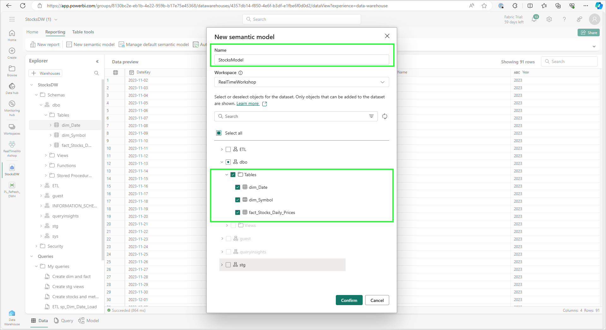
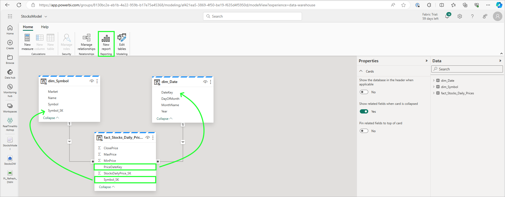
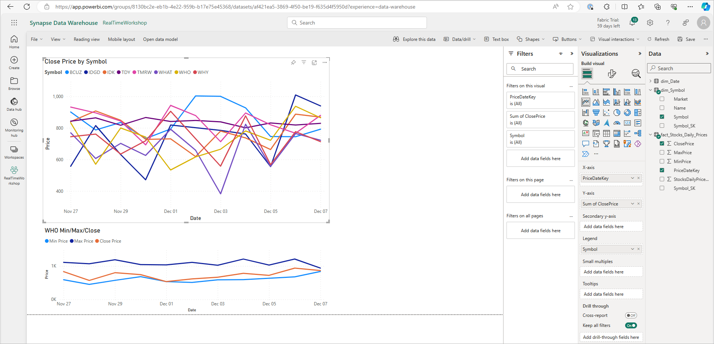

# Module 05c - Data Warehousing

[< Previous Module](../modules/module05b.md) - **[Home](../README.md)** - [Next Module >](./module05d.md)

## :stopwatch: Estimated Duration

* 30 minutes for 05c
* 120 minutes overall

## :thinking: Prerequisites

- [x] Completed [Module 05a](../modules/module05a.md)
- [x] Completed [Module 05b](../modules/module05b.md)

## :loudspeaker: Introduction

With the completion of Module 05a and Module 05b, our warehouse and ingestion process is complete.

One final step is to operationalize the data by creating a semantic model and viewing the data in Power BI. (Naturally, we don't have a lot of data yet in the warehouse to make these reports too interesting. However, if you're planning on doing the lakehouse module, we include an optional notebook that will download and incorporate additional historic information to make these reports more interesting.)

This module is broken down into 3 submodules:
* [Module 05a - Setting up the Warehouse and Pipeline](./module05a.md)
* [Module 05b - Building the dimension and fact tables, completing the pipeline](./module05b.md)
* [Module 05c - Semantic Modeling and reporting](./module05c.md)

## Table of Contents

1. [Create a semantic model](#1-create-a-semantic-model)
2. [Add relationships](#2-add-relationships)
3. [Create a simple reportl](#3-create-a-simple-report)

## 1. Create a semantic model

A semantic model, conceptually, provides an abstraction of our data for consumption in business analytics. Typically, we expose data in our data warehouse via semantic model that is then used in Power BI. At a very basic level, they will include the relationships between tables. 

> :bulb: **Did you know?**
> Power BI Datasets have recently been renamed to Semantic Models. In some cases, labels may not have been updated. The terms can be used interchangeably. Read more about this change [on the Power BI Blog](https://powerbi.microsoft.com/en-us/blog/datasets-renamed-to-semantic-models/).

When we created our data warehouse, a default semantic model was created automatically. We can leverage this in Power BI, but it also includes many artifacts of the table we may not need. So, we'll create a new semantic model with just our fact and two dimension tables.

For our model, we'll give it a name like *StocksModel*, and select only the fact and dimensions table we are concerned with (*fact_Stocks_Daily_Prices*, *dim_Date*, and *dim_Symbol*), as shown in the image below:

## 2. Add relationships

The model designer should automatically open after creating the semantic model above. If it doesn't, or if you'd like to return to the designer at a later time, you can do so by opening the model from the list of resources in the workspace, and then selecting *Open Data Model* from the semantic model item, as shown below.

To create relationships between the fact and dimension tables, drag the key from the fact table to the corresponding key in the dimension table. This should create a 1:many relationship between the two tables, and look similar to the below image. Note the button to create a *New Report* -- this will be the next step. Ensure the dimension tables are *1* while the fact table is *many* (illustrated with an asterisk in the diagrqm).

* Fact:PriceDateKey -> dim_Date:DateKey
* Fact:Symbol_SK -> dim_Symbol:Symbol_SK

## 3. Create a simple report

As shown in the image on the previous step, click *New Report* to load the semantic model in Power BI. While we won't have much data yet to make much of a report, conceptually, we can build a report similar to below, which shows a report after the lab has been running for a week or so. The top chart shows the closing price for each stock on each day, while the bottom one shows the high/low/close of the WHO stock:

A more advanced use will be integrating both historical data from the warehouse with real time data from the current day, in addition to predicted data for the future! We'll be exploring these in the lakehouse and data science modules.

## :tada: Summary

Congratulations! You created a data warehouse. While our model is simple and data size is small, the same core concepts apply: allow for future integration to handle additional data, and be sure the process can support incremental loads as needed. 

One common use case when ingesting data is to handle "slowly changing dimensions" (SCD). The concept behind SCD is to handle both current and historical data during the ingestion process. For example, suppose the stock symbol changes, the company name is changed, or some other detail is modified: a new row in the symbol table would be added (and typically marked with an IsActive flag), leaving the previous rows in place for historical reference. In this way, we'd be able to see this historical data and any point in time ("as was") in addition to the current state ("as is"). While this isn't supported in our current design for simplicity, this is a common design pattern for dimension tables.

## :white_check_mark: Results

- [x] Completed the data warehouse
- [x] Completed the pipeline
- [x] Built a semantic model
- [x] Built a simple report

## :thinking: Additional Learning

* [Data Warehousing in Fabric](https://learn.microsoft.com/en-us/fabric/data-warehouse/data-warehousing)

[Continue >](./module06a.md)