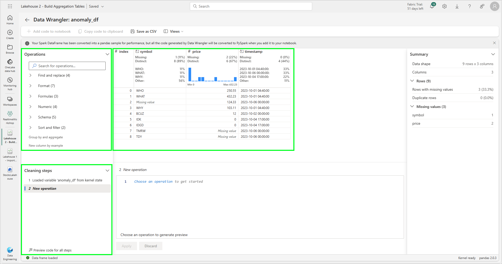
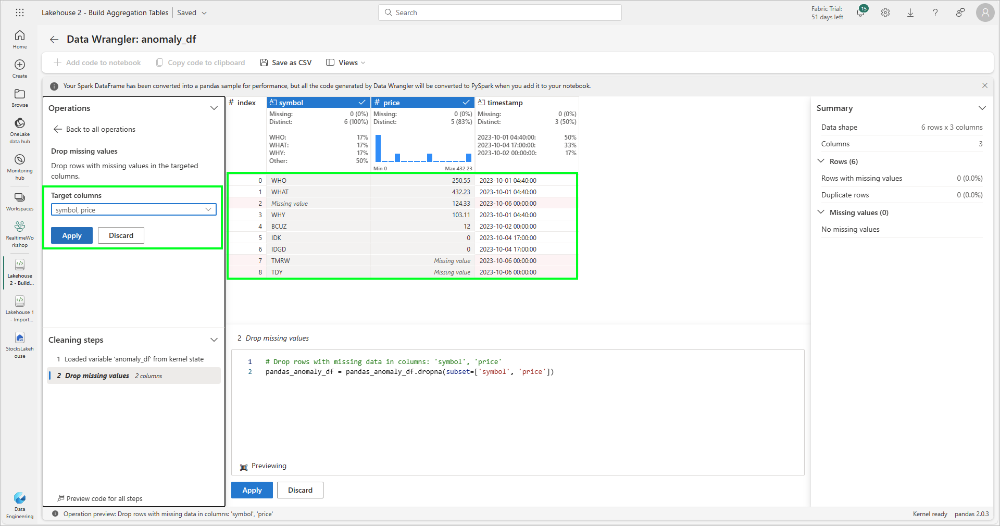
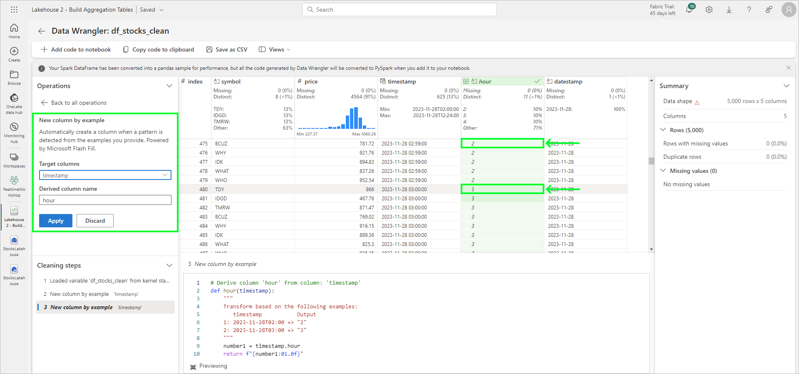
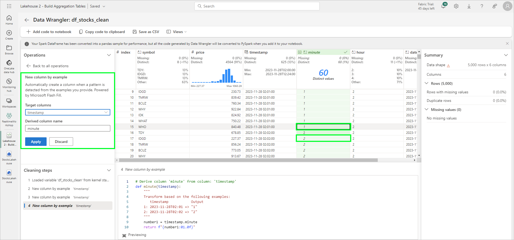
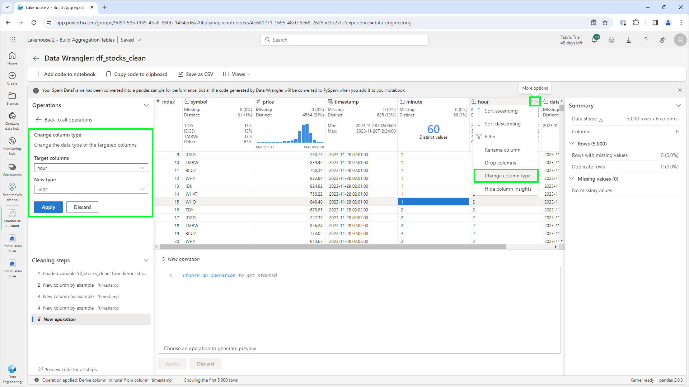
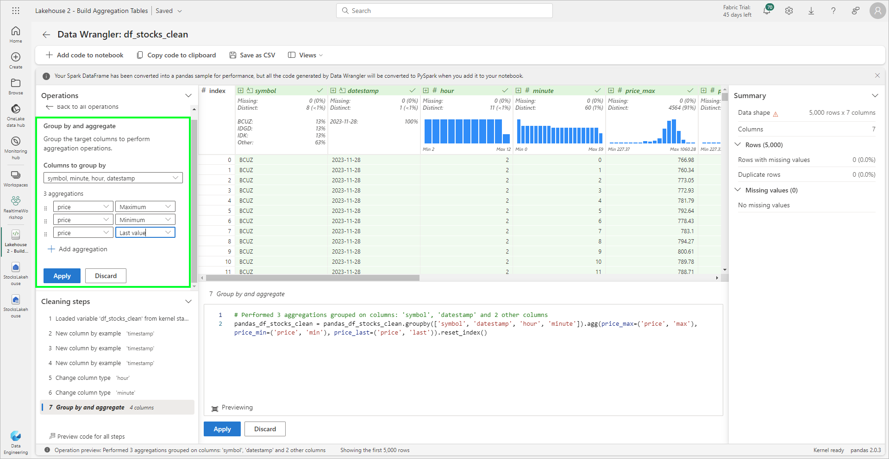
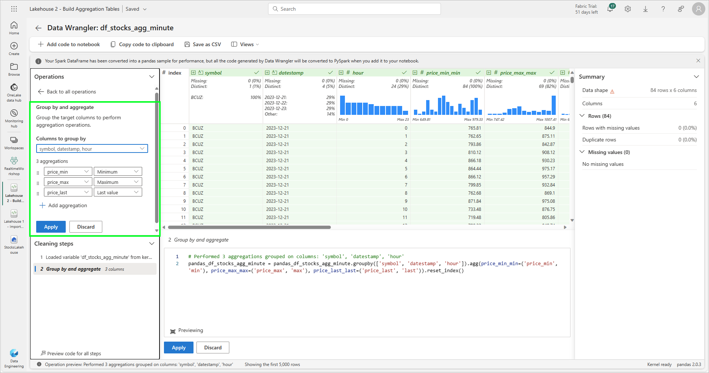

# Module 06b - Data Lakehouse: Building the Aggregation Tables

[< Previous Module](./module06a.md) - **[Home](../README.md)** - [Next Module >](./module06c.md)

## :stopwatch: Estimated Duration

* 45 minutes 

## :thinking: Prerequisites

- [x] Completed [Module 06a - Setting up the Lakehouse](../modules/module06a.md)

## :book: Sections

This module is broken down into the following sections:

* [Module 06a - Setting up the Lakehouse](./module06a.md)
* [Module 06b - Building the Aggregation Tables](./module06b.md)
* [Module 06c - Building the Dimensional Model](./module06c.md)

## :loudspeaker: Introduction

Our goal in this module is to build curated and aggregated data suitable for use in building our dimensional model and in data science. With the raw data having a per-second frequency, this data size is often not ideal for reporting or analysis. Further, the data isn't cleansed, so we're at risk of non-conforming data causing issues in reports or pipelines where erroneous data isn't expected. These new tables will store the data at the per-minute and per-hour level. Fortunately, *data wrangler* makes this an easy task.

As a refresher, a traditional medallion architecture looks similar to:

```mermaid
flowchart LR
    A[Event Hub] --> B{Eventstream}
    B --> C[(Bronze / raw)]
    C --> D[(Silver / curated)]
    D --> E[(Gold / modeled)]
```

The notebook used here will build both aggregation tables, which are silver-level artifacts. While it is common to separate medallion layers into different lakehouses, given the small size of our data and for the purposes of our lab, we'll be using the same lakehouse to store all layers.

By the end of this module, our data flow will look like:

```mermaid
flowchart LR
    subgraph Bronze [Bronze]
    B[(raw_stock_data)]
    end
    subgraph Silver [Silver]
    B[(raw_stock_data)] --> C[(stocks_minute_agg)]
    B[(raw_stock_data)] --> D[(stocks_hour_agg)]
    end
```

Prefer video content? These videos illustrate the content in this module:
* [Getting Started with Lakehouses in Microsoft Fabric](https://youtu.be/H2fFDaxUkfY)
* [Getting Started with Data Wrangler in Microsoft Fabric](https://youtu.be/iMoUXkH6u6c)

## Table of Contents

1. [Import Notebook](#1-import-notebook)
2. [Review the notebook](#2-review-the-notebook)
3. [Build cleansing routine](#3-build-cleansing-routine)
4. [Build aggregation routine](#4-build-aggregation-routine)
5. [Run the merge](#5-run-the-merge)
6. [Aggregate hourly](#6-aggregate-hourly)
7. [Exploring the data wrangler steps](#7-exploring-the-data-wrangler-steps)

## 1. Import Notebook

For this module, we'll use the *Lakehouse 2 - Build Aggregation Tables* notebook. If you haven't already loaded the notebooks from the previous module, all of the notebooks are listed below. In addition to the links below, all assets for this workshop may also be downloaded in the following zip file. Download and extract to a convenient location. The notebooks are located in the */module06* folder:

* [All Workshop Resources (resources.zip)](https://github.com/microsoft/fabricrealtimelab/raw/main/files/resources.zip)

To manually view and download each notebook, click on the notebook link below for each notebook. The notebook is presented in a readable format in GitHub -- click the download button near the upper right to download the notebook, and save the ipynb notebook file to a convenient location.

* [Lakehouse 1 - Import Data](<../resources/module06/Lakehouse 1 - Import Data.ipynb>)
* [Lakehouse 2 - Build Aggregation Tables](<../resources/module06/Lakehouse 2 - Build Aggregation Tables.ipynb>)
* [Lakehouse 3 - Create Star Schema](<../resources/module06/Lakehouse 3 - Create Star Schema.ipynb>)
* [Lakehouse 4 - Load Star Schema](<../resources/module06/Lakehouse 4 - Load Star Schema.ipynb>)


From the data engineering persona home page, select *Import notebook*, and import each of the above notebooks into your workspace:


## 2. Review the notebook

Take a moment to scroll through the notebook. Be sure to add the default lakehouse if it is not already added. Notice the following:

1. Two tables in the lakehouse are created: *stocks_minute_agg* and *stocks_hour_agg* if they do not already exist.
2. An 'anomaly' dataframe is created to illustrate data cleansing.
3. A merge function writes the data to the tables. Merging is convenient when we may want to insert or update existing rows.
4. The latest data written to the tables is queried. Notice that we are not using a watermark to keep track of what has been imported (as was done in Module 5). Because we're aggregating to the minute or hour, we'll process all data from the most recent hour/minute.
5. **Important!** There are *three* placeholders for data wrangler code you will be creating. Example data wrangler code is commented-out for reference/troubleshooting, if you do not want to complete the data wrangling steps, or are stuck and would like some help.

## 3. Build cleansing routine

In the *Lakehouse 2 - Build Aggregation Tables* notebook, run all of the cells individually until the first cell with the content "# add data wrangler here", running the cell immediately above that loads *df_stocks* from the table. Click in the "# add data wrangler here" cell to make it the active cell. From the top window, select the *Data* tab, and click *Transform DataFrame in Data Wrangler*:


A list of all dataframes (both pandas and Spark) will be listed. Data wrangler can work with both types of dataframes. For this first exercise, select *anomaly_df* to load the dataframe in data wrangler. We'll use the *anomaly_df* because it was intentionally created with a few invalid rows that can be tested. Once loaded, the screen should look like:



In data wrangler, we'll record a number of steps to process data. In the screenshot above, notice the data is visualized in the central column. Operations are in the top left, while an overview of each step is in the bottom left. Once completed, the code that performs these steps will be added to our notebook where we can further refine as needed. For this first task and to get familiar with data wrangler, we'll preprocess the data by getting rid of invalid/null data, or where prices are zero. 

To remove null/empty values:

Under *Operations* > *Find and replace*, click *Drop missing values*. From the *Target columns* dropdown, select the *symbol* and *price* columns and click *Apply*. Notice the rows that match are highlighted in red in the middle window (in the screenshot below). Click *Apply* under the *Target columns* dropdown.



To remove zero-price values:

Under *Operations* > *Sort and filter*, click *Filter*. **Uncheck** *Keep matching rows*, select *price* as the target column, and set the condition to *equal* to *0*. Notice the rows with zero are marked red as they will be dropped (if the other rows are marked red, be sure to uncheck the *Keep matching rows* checkbox). Click *Apply* in the *Operations* panel beneath the Filter.


Click *Add code to notebook* in the upper left. On the *Add code to notebook* window, ensure *Include pandas code* is unchecked and click *Add*. The code inserted will look similar to the below:

```python
# Code generated by Data Wrangler for PySpark DataFrame

def clean_data(anomaly_df):
    # Drop rows with missing data in columns: 'symbol', 'price'
    anomaly_df = anomaly_df.dropna(subset=['symbol', 'price'])
    # Filter rows based on column: 'price'
    anomaly_df = anomaly_df.filter(~(anomaly_df['price'] == 0))
    return anomaly_df

anomaly_df_clean = clean_data(anomaly_df)
display(anomaly_df_clean)
```

Run the cell and observe the output has removed the invalid rows.

The function created, *clean_data*, contains all of the steps in sequence and can be modified as needed. Notice that each step performed in data wrangler is commented. Because data wrangler was loaded with the *anomaly_df*, the method is written to take that dataframe by name, but this can be any dataframe that matches the schema. Additionally, we can edit the name of the function if we'd like it to be a bit clearer. 

Modify the function name from *clean_data* to *remove_invalid_rows*, and change the line *anomaly_df_clean = clean_data(anomaly_df)* to *df_stocks_clean = remove_invalid_rows(df_stocks)* as shown below. Also, while not necessary for functionality, you can change the name of the dataframe used in the function to simply *df* as shown below:

```python
# Code generated by Data Wrangler for PySpark DataFrame

def remove_invalid_rows(df):
    # Drop rows with missing data in columns: 'symbol', 'price'
    df = df.dropna(subset=['symbol', 'price'])
    # Filter rows based on column: 'price'
    df = df.filter(~(df['price'] == 0))
    return df

df_stocks_clean = remove_invalid_rows(df_stocks)
display(df_stocks_clean)
```

This function will now remove the invalid rows from our *df_stocks* dataframe and return a new dataframe called *df_stocks_clean*. It is common to use a different name for the output dataframe (such as *df_stocks_clean*) to make the cell idempotent -- this way, we can go back and re-run the cell, make modifications, etc., without having to reload our original data.

Run this cell and observe the output before continuing to the next step.

## 4. Build aggregation routine

This next series will be more involved because we'll build a number of steps in data wrangler, adding derived columns and aggregating the data. If you get stuck, continue as best you can and use the sample code in the notebook to help fix any issues after.

Scroll down just past the commented-out example code to the *Symbol/Date/Hour/Minute Aggregation Section*, placing your cursor in the *Add data wrangler here* cell. Load data wrangler again, this time selecting the *df_stocks_clean* dataframe. Perform the following steps:

**Step 1: Add new datestamp column**

Select *Operations* > *New column by example*. Under *Target columns*, choose *timestamp*. Enter a *Derived column name* of *datestamp*. Do **not** yet click *Apply*; in the new *datestamp* column, enter an example value for any given row. For example, if the *timestamp* is *2023-11-28 02:00:00* enter *2023-11-28*. This allows data wrangler to infer we are looking for the date without a time component; once the columns autofill, click *Apply*:


**Step 2: Add new hour column**

Similar to adding the *datestamp* column above, create a new column named *hour*, also using *timestamp* in the *Target columns*. In the new *hour* column that appear in the data preview, enter an hour for any given row -- but try to pick a row that has a unique hour value. For example, if the *timestamp* is *2023-11-28 02:59:00* enter *2*. You may need to enter example values for several rows, as shown here:



Data wrangler should infer we are looking for the hour component, and build code similar to:

```python
# Derive column 'hour' from column: 'timestamp'
def hour(timestamp):
    """
    Transform based on the following examples:
        timestamp           Output
    1: 2023-11-28T02:59 => "2"
    2: 2023-11-28T03:00 => "3"
    """
    number1 = timestamp.hour
    return f"{number1:01.0f}"
```

> :bulb: **Problems with hour or minute?**
> In the event data wrangler isn't correctly inferring the hour or minute components, try a different row with more unique values. Some date/time values are difficult, such as "2024-01-01 01:01:00". If it is still troublesome, just continue and this can be fixed manually after the code is added to the notebook.

**Step 3: Add new minute column**

Same as with the hour column, create a new *minute* column. In the new *minute* column, enter a minute for any given row. For example, if the *timestamp* is *2023-11-28 02:01:00* enter *1*. You may need to enter example values for several rows. 



The code generated should look similar to:

```python
# Derive column 'minute' from column: 'timestamp'
def minute(timestamp):
    """
    Transform based on the following examples:
        timestamp           Output
    1: 2023-11-28T02:01 => "1"
    2: 2023-11-28T02:02 => "2"
    """
    number1 = timestamp.minute
    return f"{number1:01.0f}"
```

**Step 4: Convert the hour to integer**

Next, convert the hour column to an integer. Click on the ellipsis (...) in the corner of the *hour* column and select *Change column type*. For the *New type*, select *int32* and click *Apply*. See image below for reference:



**Step 5: Convert the minute to integer**

Convert the minute column to an integer using the same steps as you just performed for the hour. Click on the ellipsis (...) in the corner of the *minute* column and select *Change column type*. For the *New type*, select *int32* and click *Apply*.

**Step 6: Group by symbol, datestamp, hour, and minute**

Under *Operations*, click *Group by and aggregate*. For *Columns to group by*, select *symbol*, *datestamp*, *hour*, *minute*. 

Using *Add aggregation*, create a total of three aggregations:

* price: Maximum
* price: Minimum
* price: Last value

This should look similar to the image below:



Click *Apply* and add the code to the notebook. 

**Step 8: Review the code**

In the cell that is added, in the last two lines of the cell, notice the dataframe returned is named *df_stocks_clean_1*. Rename this *df_stocks_agg_minute*, and change the name of the function to *aggregate_data_minute*, as shown below. Remember, if you get stuck, refer to the commented-out code as a reference. The purpose of this step is to help keep the steps throughout the notebook tidy:

```python
# old:
def clean_data(df_stocks_clean):
  ...

df_stocks_clean_1 = clean_data(df_stocks_clean)
display(df_stocks_clean_1)
```

```python
# new:
def aggregate_data_minute(df_stocks_clean):
  ...

df_stocks_agg_minute = aggregate_data_minute(df_stocks_clean)
display(df_stocks_agg_minute)
```

If any of the data wrangling steps don't seem to be quite correct (not getting the correct hour or minute, for example), refer to the commented-out samples. Step 7 below has a number of additional considerations that may help.

> :bulb: **Uncommenting or Commenting Large Blocks:**
> If you'd like to comment-out (or uncomment) large blocks, you can highlight the section of code (or CTRL-A to select everything in the current cell) and use CTRL-/ (Control *slash*) to toggler commenting.

## 5. Run the merge

Run the next cell that calls the merge function, which writes the data into the table:

```python
# write the data to the stocks_minute_agg table

merge_minute_agg(df_stocks_agg_minute)
```

## 6. Aggregate hourly

Let's review current progress: our per-second data has been cleansed, and then summarized to the per-minute level. This reduces our rowcount from 86,400 rows/day to 1,440 rows/day per stock symbol. For reports that might show monthly data, we can further aggregate the data to per-hour frequency, reducing the data to 24 rows/day per stock symbol. 

This final data wrangler step will be easier than the previous. In the final placeholder under the *Symbol/Date/Hour* section, load the existing *df_stocks_agg_minute* dataframe into data wrangler.

Under *Operations*, select *Group by and aggregate*, grouping by *symbol*, *datestamp*, and *hour*, and then creating three aggregations:

* price_min: Minimum
* price_max: Maximum
* price_last: Last value

This should look like:



Example code is shown below. In addition to renaming the function to *aggregate_data_hour*, the alias of each price column has also been changed to keep the column names the same. Because we are aggregating data that has already been aggregated, data wrangler is naming the columns like price_max_max, price_min_min; we will modify the aliases to keep the names the same for clarity.

Finally, we also named the return dataframe *df_stocks_agg_hour* as shown in the code snippet below:

```python
# Code generated by Data Wrangler for PySpark DataFrame

from pyspark.sql import functions as F

def aggregate_data_hour(df_stocks_agg_minute):
    # Performed 3 aggregations grouped on columns: 'symbol', 'datestamp', 'hour'
    df_stocks_agg_minute = df_stocks_agg_minute.groupBy('symbol', 'datestamp', 'hour').agg(
        F.max('price_max').alias('price_max'), 
        F.min('price_min').alias('price_min'), 
        F.last('price_last').alias('price_last'))
    df_stocks_agg_minute = df_stocks_agg_minute.dropna()
    df_stocks_agg_minute = df_stocks_agg_minute.sort(df_stocks_agg_minute['symbol'].asc(), df_stocks_agg_minute['datestamp'].asc(), df_stocks_agg_minute['hour'].asc())
    return df_stocks_agg_minute

df_stocks_agg_hour = aggregate_data_hour(df_stocks_agg_minute)
display(df_stocks_agg_hour)
```

The code to merge the hour aggregated data is in the next cell:

```python
merge_hour_agg(df_stocks_agg_hour)
```

Run the cell to complete the merge. There are a few utility cells at the bottom for checking the data in the tables -- explore the data a bit and feel free to experiment.

## 7. Exploring the data wrangler steps

This step is optional and explores the data wrangler generated code.

By now, hopefully you'll agree how useful data wrangler can be. The code generated follows the exact steps executed in the tool, and is either generated for Spark or pandas dataframes and should work across virtually any scenario. The code generated is there as a template for us to modify if we'd like -- we can add, remove, or change the steps as we'd like. Sometimes, the code may not be exactly what we have in mind or we might know a more optimal method. This often occurs because the way types are handled may vary (for example, Spark has decimal types, but Pandas does not natively).

For example, consider the code that generates the datestamp:

```python
# Original data wrangler code:
# Derive column 'datestamp' from column: 'timestamp'
    
# Transform based on the following examples:
#    timestamp                  Output
# 1: 2023-12-01T13:22:00.938 => "2023-12-01"
udf_fn = F.udf(lambda v : v.strftime("%Y-%m-%d"), T.StringType())
df_stocks_clean = df_stocks_clean.withColumn("datestamp", udf_fn(F.col("timestamp")))
```

This code creates a user-defined function that takes a timestamp, and returns a string in the format *%Y-%m-%d*. If we'd like a native date value (without a time component), we could accomplish this using the PySpark method *to_date()* in a single line like this:

```python
# Simplified code:
df_stocks_clean = df_stocks_clean.withColumn("datestamp", to_date(F.col("timestamp")))
```

As another example, the data wrangler code that derives the hour column and then converts it to an integer will look similar to:

```python
# Original data wrangler code:
# Derive column 'hour' from column: 'timestamp'
    
def hour(timestamp):
    """
    Transform based on the following examples:
        timestamp                  Output
    1: 2023-12-01T13:22:00.938 => "13"
    """
    number1 = timestamp.hour
    return f"{number1:01.0f}"

udf_fn = F.udf(lambda v : hour(v), T.StringType())
df_stocks_clean = df_stocks_clean.withColumn("hour", udf_fn(F.col("timestamp")))
# Change column type to int32 for column: 'hour'
df_stocks_clean = df_stocks_clean.withColumn('hour', df_stocks_clean['hour'].cast(T.IntegerType()))
```

The code creates a user-defined function that expects a timestamp, extracts the timestamp.hour, and returns a formatted number as a string. The value is then cast as an integer. Since we're only interested in the hour as an integer, we could reduce the code to:

```python
# Simplified code:
df_stocks_clean = df_stocks_clean.withColumn("hour", date_format(F.col("timestamp"), "H").cast(T.IntegerType()))
```

The simplified function would look like:

```python
# Code generated by Data Wrangler for PySpark DataFrame

from datetime import datetime
from pyspark.sql import functions as F
from pyspark.sql import types as T

def aggregate_data_minute(df_stocks_clean):
    # Derive column 'datestamp' from column: 'timestamp'
    df_stocks_clean = df_stocks_clean.withColumn("datestamp", to_date(F.col("timestamp")))

    # Derive column 'hour' from column: 'timestamp'
    df_stocks_clean = df_stocks_clean.withColumn("hour", date_format(F.col("timestamp"), "H").cast(T.IntegerType()))
    # Derive column 'minute' from column: 'timestamp'
    df_stocks_clean = df_stocks_clean.withColumn("minute", date_format(F.col("timestamp"), "m").cast(T.IntegerType()))
    
    # Performed 3 aggregations grouped on columns: 'symbol', 'datestamp' and 2 other columns
    df_stocks_clean = df_stocks_clean.groupBy('symbol', 'datestamp', 'hour', 'minute').agg(F.max('price').alias('price_max'), F.min('price').alias('price_min'), F.last('price').alias('price_last'))
    df_stocks_clean = df_stocks_clean.dropna()
    df_stocks_clean = df_stocks_clean.sort(df_stocks_clean['symbol'].asc(), df_stocks_clean['datestamp'].asc(), df_stocks_clean['hour'].asc(), df_stocks_clean['minute'].asc())
    return df_stocks_clean

df_stocks_agg_minute = aggregate_data_minute(df_stocks_clean)
display(df_stocks_agg_minute)
```

You can adapt the code to suit your needs. This will vary based on the type of dataframe (Spark or pandas) which support some types differently -- time-only values, date-only values, and decimals have subtle differences.

## :tada: Summary

In this module, you leveraged data wrangler to quickly preprocess and transform raw data into silver-level tables suitable for use in data science and reporting. We began with the raw table with per-second readings for each stock; data was cleansed, then aggregated to minute-level precision (60 rows per minute reduced to 1). Then, data was aggregated again to hour-level precision. Raw data would have 3600 rows per hour, while the minute aggregated data would have 60, and now the hour data would have 1. 

## References

* [Fabric Medallion Architecture](https://learn.microsoft.com/en-us/fabric/onelake/onelake-medallion-lakehouse-architecture)
* [Wikipedia:Lambda architecture](https://en.wikipedia.org/wiki/Lambda_architecture)
* [Fabric Storage Decision Guide](https://learn.microsoft.com/en-us/fabric/get-started/decision-guide-data-store)

## :white_check_mark: Results

- [x] Cleansed raw data
- [x] Built aggregation routine in data wrangler
- [x] Loaded new aggregation tables 

[Continue >](./module06c.md)