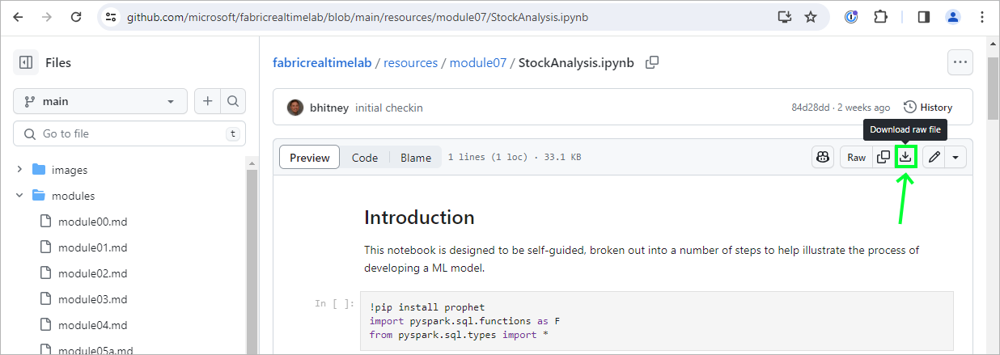
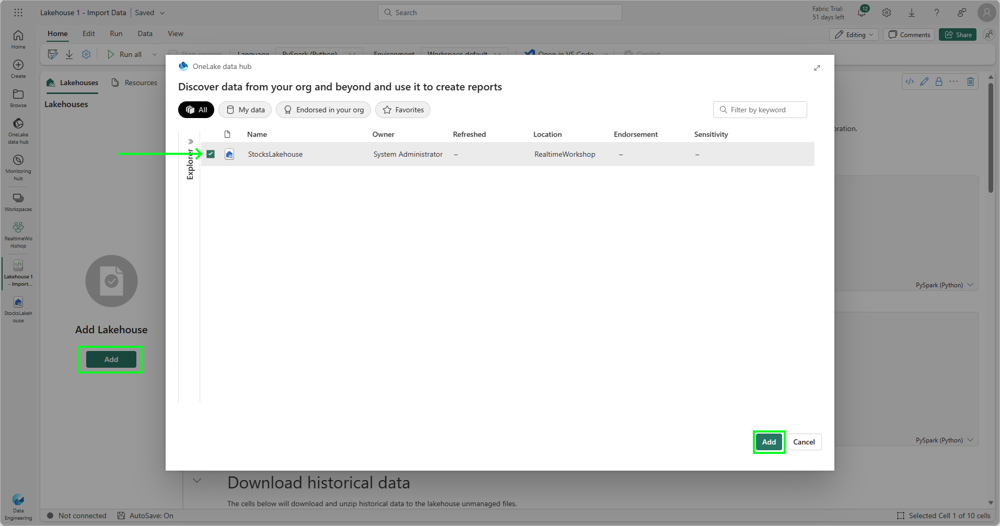
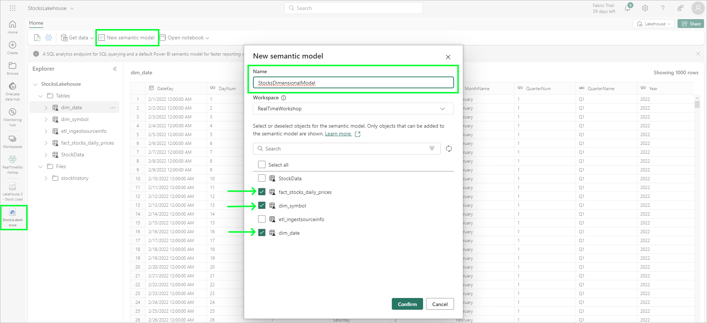
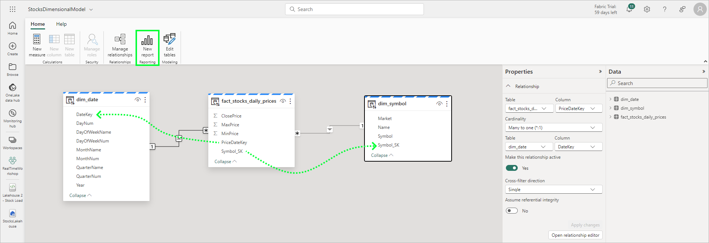
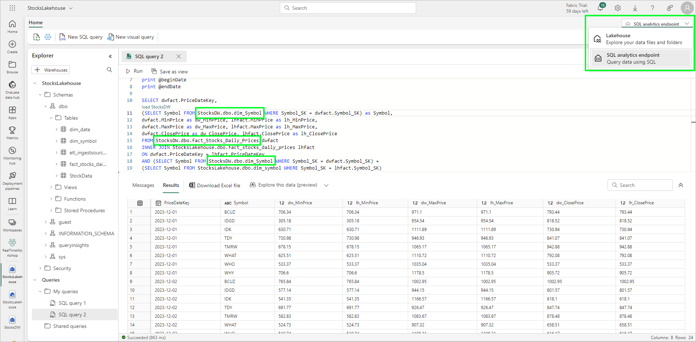

# Module 06a - Data Lakehouse: Building a Lakehouse

[< Previous Module](./module06b.md) - **[Home](../README.md)** - [Next Module >](./module07a.md)

## :stopwatch: Estimated Duration

* 30 minutes 

## :thinking: Prerequisites

- [x] Completed [Module 06a - Setting up the Lakehouse](../modules/module06a.md)
- [x] Completed [Module 06b - Building the Aggregation Tables](../modules/module06b.md)

## :book: Sections

This module is broken down into the following sections:

* [Module 06a - Setting up the Lakehouse](./module06a.md)
* [Module 06b - Building the Aggregation Tables](./module06a.md)
* [Module 06c - Building the Dimensional Model](./module06b.md)

## :loudspeaker: Introduction

In this module, we'll further refine our aggregation tables and create a traditional star schema using fact and dimension tables. If you've completed the Data Warehouse module, this module will produce a similar result, but is different in approach by using notebooks within a lakehouse. (Note: it is possible to use pipelines to orchestrate activities, but this solution will be done completely within notebooks.)

If you completed module 05 (data warehouse), this dimensional model will look familiar:

```mermaid
erDiagram
    "Stock Price Fact" }o--|| "Date Dimension":DateKey
    "Stock Price Fact" {
        int Symbol_SK
        date DateKey
        float MinPrice
        float MaxPrice
        float ClosePrice
    }
    "Date Dimension" {
        date DateKey
        int DayNum
        int DayOfWeekNum
        string DayOfWeekName
        int MonthNum
        string MonthName
        int QuarterNum
        string QuarterName
        int Year
    }
    "Stock Price Fact" }o--|| "Symbol Dimension":Symbol_SK
    "Symbol Dimension" {
        int Symbol_SK
        string Symbol
        string Name
        string Market
    }
```

## Table of Contents

1. [Import notebooks](#1-import-notebooks)
2. [Create schema](#2-create-schema)
3. [Load fact table](#3-load-fact-table)
4. [Build semantic model and simple report](#4-build-semantic-model-and-simple-report)
5. [Notebook orchestration](#5-notebook-orchestration)
6. [Additional challenge for the overachiever](#6-additional-challenge-for-the-overachiever)

## 1. Import notebooks

For this module, we'll use the *Lakehouse 3 - Create Star Schema* and *Lakehouse 4 - Load Star Schema* notebooks. If you haven't already loaded the notebooks from the previous module, all of the notebooks are listed below. In addition to the links below, all assets for this workshop may also be downloaded in the following zip file. Download and extract to a convenient location. The notebooks are located in the */module06* folder:

* [All Workshop Resources (resources.zip)](https://github.com/microsoft/fabricrealtimelab/raw/main/files/resources.zip)

To manually view and download each notebook, click on the notebook link below for each notebook. The notebook is presented in a readable format in GitHub -- click the download button near the upper right to download the notebook, and save the ipynb notebook file to a convenient location.

* [Lakehouse 1 - Import Data](<../resources/module06/Lakehouse 1 - Import Data.ipynb>)
* [Lakehouse 2 - Build Aggregation Tables](<../resources/module06/Lakehouse 2 - Build Aggregation Tables.ipynb>)
* [Lakehouse 3 - Create Star Schema](<../resources/module06/Lakehouse 3 - Create Star Schema.ipynb>)
* [Lakehouse 4 - Load Star Schema](<../resources/module06/Lakehouse 4 - Load Star Schema.ipynb>)



From the data engineering persona home page, select *Import notebook*, and import each of the above notebooks into your workspace:


## 2. Create schema

Click on your workspace to view all items in your *RealTimeWorkshop* workspace and open the *Lakehouse 3 - Create Schema* notebook. If you have trouble finding items as your workspace grows, you can view only the notebooks by clicking the filter and selecting *Notebook*:


If there is no lakehouse associated with the notebook, click *Add* underneath the text *Add Lakehouse*, and add the lakehouse created earlier. *Important*: You will need to add the lakehouse to every imported notebook -- do this each time you open a notebook for the first time.



With the notebook loaded and the lakehouse attached, notice the schema on the left. We should see the *raw_stock_data* tablem as well as the *stocks_minute_agg* and *stocks_hour_agg* tables.

*************************


Run through this entire notebook. You can either click *Run all* from the left top tool bar, but is recommended you run each cell individually by clicking the play button on the left side of each cell to follow along with the process. 

When all cells have been run, refresh the schema by clicking the three dots (...) dots to the right of the *Tables* and clicking *Refresh*, as shown in the image below. You should see additional tables for our dimensional model:

*************************


With the schema in place, we're ready to look at our main notebook that will process the incremental load into the fact table.

## 3. Load fact table

Our fact table contains the daily stock prices (the high, low, and closing price), while our dimensions are for our date and stock symbols (which might contain company details and other information). Although simple, conceptually this model represents a star schema that can be applied to larger datasets. 

Load the *Lakehouse 4 - Load Star Schema* notebook. Attach the lakehouse to the notebook. We recommend you run each cell individually, but you can also click *Run All*. Be sure the *sourceTableName* in the first cell matches the name of the hourly aggregation table.

When you have finished running through the notebook, there are a few key points to keep in mind: 

* While this notebook can be run as a scheduled task, it's primarily designed to be used interactively. We could remove much of the display code and other artifacts to improve performance.
* Take note of the symbol incremental load (*dim_symbol_incremental_load*). A business question that must be asked is, "Can we handle new stock symbols in the data feed?" In a real world scenario, this might be a common scenario, or it may not be possible depending on the data source. In this case, the notebook will support new symbols that might not exist in the symbol dimension table, however, this takes processing time. As with all business problems, this is a tradeoff between performance and functionality, and will vary by business needs.
* This notebook loads data from the *stocks_hour_agg* table. Because the *stocks_hour_agg* table is also loaded from a notebook, we'd typically orchestrate all of these activities from either a pipeline, spark job, or master notebook.

To scheduled the notebook to run periodically, click on the *Run* tab, and click *Schedule*. The notebook can be configured to run periodically (such as every hour or as neededw):


## 4. Build semantic model and simple report

In this step, we'll create a new semantic model that we can use for reporting, and create a simple Power BI report.

Open the *StocksLakehouse*, and from the top nav bar, select *New semantic model*. Name the model *StocksDimensionalModel* and select the fact and two dimension tables, as show below:



When the semantic model opens, we need to define relationships between the fact and dimension tables. The easiest way to do this is to drag the *Symbol_SK* from the fact table to the *Symbol_SK* on the *dim_symbol* table, and ensure there is a 1:many relationship between the *dim_symbol* (one) and the fact table (many). Similarly, drag the *PriceDateKey* from the fact table to the *DateKey* column on the *dim_date* table:



When complete, click the *New report* button to create a new report. Similar to our reports created in earlier modules, add a line chart to our canvas, and configure it as follows:

* X-axis: PriceDateKey (fact_stocks_daily_prices)
* Y-axis: ClosePrice (fact_stocks_daily_prices)
* Legend: Symbol (dim_symbol)


## 5. Notebook orchestration

As an optional challenge, build a more refined orchestration for the two primary notebooks that load data. 

Both the *Lakehouse 2 - Build Aggregation Tables* and *Lakehouse 4 - Load Star Schema* need to be run periodically and,ideally, in order because the *Lakehouse 4* notebook depends on data from the aggregation tables. There are a variety of ways to accomplish this, such as:

* A Data Pipeline can be used to orchestrate the execution.
* The notebooks can be scheduled periodically at offset times.
* A master notebook can be used to execute each notebook.
* The notebooks could be integrated into one master notebook

What are the pros/cons of the different approaches?

## 6. Additional challenge for the overachiever

This step is optional.

Have you completed both the Synapse data warehouse and lakehouse (this) modules? If so, you have two dimensional models made with very different approaches, but yield the same results. At least, they _should_ yield the same results. How can you check?

Fortunately, this is quite easy. The lakehouse exposes a SQL analytics endpoint that can be queried, so we can join to lakehouse tables as if they were in our Synapse data warehouse. Alternatively, we can join to the Synapse data warehouse from the lakehouse.

In this example, we'll use SQL from the Synapse data warehouse to compare results. 

In our Synapse data warehouse, create a *New SQL query*, and enter the following T-SQL. Note that the names of the lakehouse may need to be modified slightly depending on how it was named, and the dates can be set automatically or specifically as needed:

```sql
declare @beginDate date = '2023-12-01'
declare @endDate date = '2023-12-03'

-- comment these lines out to use hard-coded dates
set @endDate = (SELECT coalesce(max(PriceDateKey),convert(Date, getdate())) FROM dbo.fact_Stocks_Daily_Prices)
set @beginDate = DATEADD(day, -2, @endDate)

print @beginDate
print @endDate

SELECT dwfact.PriceDateKey, 
(SELECT Symbol FROM dim_Symbol WHERE Symbol_SK = dwfact.Symbol_SK) as Symbol,
dwfact.MinPrice as dw_MinPrice, lhfact.MinPrice as lh_MinPrice,
dwfact.MaxPrice as dw_MaxPrice, lhfact.MaxPrice as lh_MaxPrice,
dwfact.ClosePrice as dw_ClosePrice, lhfact.ClosePrice as lh_ClosePrice
FROM dbo.fact_Stocks_Daily_Prices dwfact
INNER JOIN StocksLakehouse.dbo.fact_stocks_daily_prices lhfact
ON dwfact.PriceDateKey = lhfact.PriceDateKey 
AND (SELECT Symbol FROM dim_Symbol WHERE Symbol_SK = dwfact.Symbol_SK) = 
(SELECT Symbol FROM StocksLakehouse.dbo.dim_symbol WHERE Symbol_SK = lhfact.Symbol_SK)
WHERE dwfact.PriceDateKey >= @beginDate and 
dwfact.PriceDateKey <= @endDate
ORDER BY dwfact.PriceDateKey ASC, Symbol ASC
```

The query above will pull the min, max, and close price for each stock over the time period from both the data warehouse and lakehouse, and place them side-by-side in the query results. The results should be identical for the data warehouse and lakehouse. However, because the data for the lakehouse may have been set up some time after the KQL database that is used to feed the data warehouse, it is possible some values may not be equal if the max or min prices occured before data was being ingested into the lakehouse.


From the lakehouse, the same query can be run. From within the lakehouse, switch to the *SQL analytics endpoint* in the top right of the lakehouse page. Using the same query, modify the data warehouse connection to be fully qualified. For example, instead of *from dim_symbol* change to match your data warehouse name, such as *from StocksDW.dbo.dim_symbol*. There are three locations where this will need to be changed: 



Congratulations! You've not only compared the results, you've seen how easy it is to integrate both data warehouse and lakehouse artifacts. Notebooks can query the data warehouse from Spark, as well. Keep in mind: a lakehouse is read-only from a SQL analytics endpoint. A Synapse data warehouse is read-only from Spark. See [this decision guide](https://learn.microsoft.com/en-us/fabric/get-started/decision-guide-data-store) for more information.

## :tada: Summary

In this module, we further processed the data from the aggregation tables (silver) into a refined schema (gold) schema by using dimension and fact tables. These new tables were then added to a new semantic model for reporting, which was then used in a Power BI report.

## References

* [Fabric Medallion Architecture](https://learn.microsoft.com/en-us/fabric/onelake/onelake-medallion-lakehouse-architecture)
* [Wikipedia page on Lambda architecture](https://en.wikipedia.org/wiki/Lambda_architecture)
* [Fabric Storage Decision Guide](https://learn.microsoft.com/en-us/fabric/get-started/decision-guide-data-store)

## :white_check_mark: Results

- [x] Created the schema for the dimensional model
- [x] Loaded the dimensional model from the hourly aggregation table
- [x] Created a semantic model and simple Power BI report

[Continue >](./module07a.md)