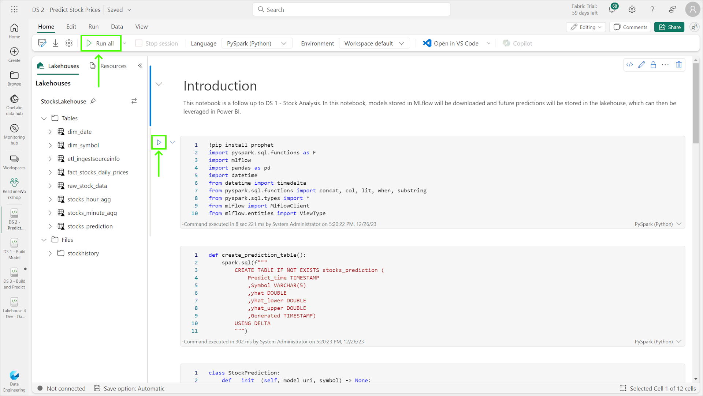

# Module 07b - Data Science: Using models, saving to Lakehouse, building a report

[< Previous Module](./module07a.md) - **[Home](../README.md)** - [Next Module >](./module07c.md)

## :stopwatch: Estimated Duration

* 20 minutes for 07b
* 2 hours overall

## :thinking: Prerequisites

- [x] Completed Module 07a

Recommended modules for reports:

- [x] Completed [Module 01 - KQL Database](../modules/module01.md)
- [x] Completed [Module 02 - KQL Queries](../modules/module02.md)
- [x] Completed [Module 03 - Reporting](../modules/module03.md)
- [x] Completed [Module 06 - Lakehouse](../modules/module06a.md)

You can complete the reporting section without the recommended modules above, but the functionality will be limited.

## :book: Sections

This module is broken down into 4 sections:

* [Module 07a - Building and storing an ML model](./module07a.md)
* [Module 07b - Using models, saving to the lakehouse](./module07b.md)
* [Module 07c - Solution in practice](./module07c.md)
* [Module 07d - Building a Prediction Report](./module07d.md)

## :loudspeaker: Introduction

This module is a continuation of module 07a. In module 07a, the stock data was analyzed, an ML model was built and registered in MLflow.

In this module, we'll use a notebook that queries MLflow for available models, and builds predictions from those models. The goal of this approach is to illustrate the separation of model creation and consumption. This will bring us one step closer to connecting all of the pieces.

Prefer video content? These videos illustrate the content in this module:
* [Getting Started with Data Science in Microsoft Fabric, Part 1](https://youtu.be/kdUIUPwIy4g)
* [Getting Started with Data Science in Microsoft Fabric, Part 2](https://youtu.be/GFTDxnPDTpQ)

## Table of Contents

1. [Open and explore the notebook](#1-open-and-explore-the-notebook)
2. [Run the notebook](#2-run-the-notebook)

## 1. Open and explore the notebook

Open the *DS 2 - Predict Stock Prices* notebook. For reference, the notebooks used throughout this module are listed below. More details on importing these are in module 07a.

All resources (notebooks, scripts, etc.) for all modules can be downloaded in this zip file:

* [All Workshop Resources (resources.zip)](https://github.com/microsoft/fabricrealtimelab/raw/main/files/resources.zip)

Individually view and download:

* [Download the DS 1 - Build Model Notebook](<../resources/module07/DS 1 - Build Model.ipynb>)
* [Download the DS 2 - Predict Stock Prices Notebook](<../resources/module07/DS 2 - Predict Stock Prices.ipynb>)
* [Download the DS 3 - Forecast All](<../resources/module07/DS 3 - Forecast All.ipynb>)

Take a few moments to explore the *DS 2 - Predict Stock Prices* notebook, and be sure to add the same default lakehouse to the notebook similar to the steps in module 07a. Many of the elements in this notebook should look familiar to *DS 1*. 

Notice that much of the notebook has been broken out into function definitions, such as *def write_predictions*, which help encapsulate logic into smaller steps. Notebooks can include other libraries (as you've seen already at the top of most notebooks), and can also execute other notebooks. This notebook completes these tasks at a high level:

* Creates the stock predictions table in the lakehouse, if it doesn't exist
* Gets a list of all stock symbols 
* Creates a prediction list by examining available ML models in MLflow
* Loops through the available ML models:
    * Generates predictions
    * Stores predictions in the lakehouse

## 2. Run the notebook

You can either run each cell manually as you follow along with the notebook, or click *Run all* in the top toolbar and follow along as the work progresses. The cells at the bottom of the notebook that delete the predictions and query the prediction data are *frozen* -- that is, they will not run and are there for testing purposes; you can use them for deleting rows or examining the table. To use them, you'll need to unfreeze the cells first, but be sure to freeze them (or comment them out) because if the entire notebook is run, these cells will be run if left unfrozen.

For the rest of this step, follow along with documentation in the notebook for an explanation of each cell. The key areas to examine closely include the interaction with MLflow (to find the ML models), and how the data is written to the lakehouse using a merge statement. The merging acts as an "upsert" -- new data will be inserted, but if a prediction already exists for a given symbol at a certain point in time, the row will be updated.

For additional exploration, return to the previous section and generate ML models for other stock symbols. Notice how this notebook should find those new ML models and generate predictions. If new ML models are created where an existing model already exists, a new version of the model will be created. This allows us to track models over time -- parameters may need to be tweaked to handle changing conditions.

Once the notebook has been run, you are ready to move to the next step. 

## :thinking: Additional Learning

* [Machine Learning Experiments in Microsoft Fabric](https://learn.microsoft.com/en-us/fabric/data-science/machine-learning-experiment)
* [Data Wrangler](https://learn.microsoft.com/en-us/fabric/data-science/data-wrangler)
* [Prophet](https://facebook.github.io/prophet/)

## :tada: Summary

In this module, you followed up on the creation of the ML model by consuming the ML model, generating predictions, and storing those predictions in the lakehouse. You then created a report (or reports) that shows the current stock prices with predicted values.

## :white_check_mark: Results

- [x] Loaded and ran the DS 2 notebook, which loaded available ML models and generated predictions
- [x] Stored the predictions in a new lakehouse table

[Continue >](./module07c.md)