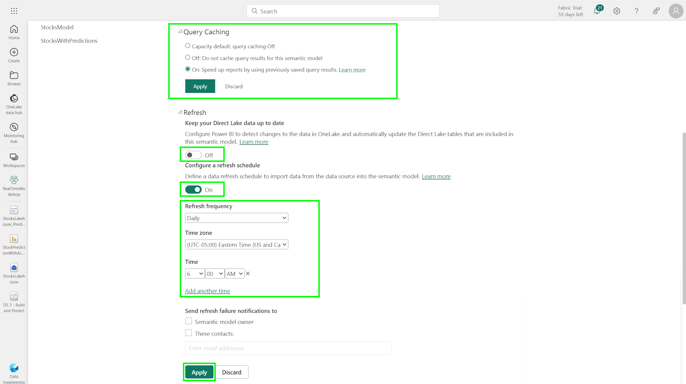
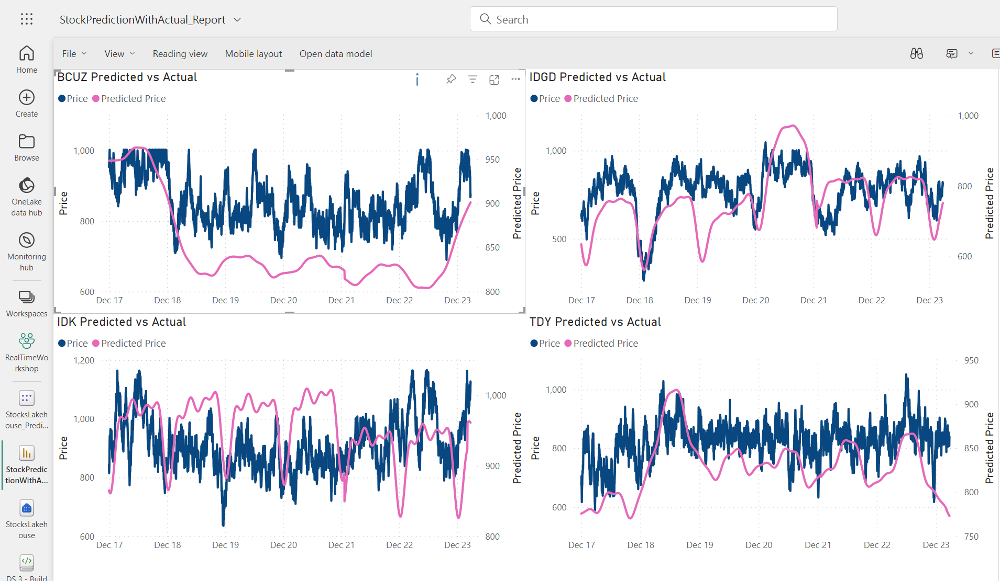

# Module 010c - Predicted vs Actual Reporting

[< Previous Module](../modules/module10b.md) - **[Home](../README.md)** 

## :stopwatch: Estimated Duration

30 minutes

## :thinking: Prerequisites

- [x] Lab environment deployed from [setup](../modules/module00.md)
- [x] Completed [Module 01](../modules/module01.md)
- [x] Completed [Module 02](../modules/module02.md)
- [x] Completed [Module 03](../modules/module03.md)
- [x] Completed [Module 06 - Data Lakehouse](../modules/module06.md)
- [x] Completed [Module 07 - Data Science](../modules/module07a.md)

## :loudspeaker: Introduction

In this module, you'll create a simple report that shows predicted vs actual values for diagnostic purposes. To do so, we'll leverage the lakehouse and predicitions table, while also creating a semantic model to take advantage of query caching and creating views in the lakehouse.

## Table of Contents

1. [Mashing up the data](#1-mashing-up-the-data)
2. [Build the lakehouse views](#2-build-the-lakehouse-views)
3. [Build a semantic model](#3-build-a-semantic-model)
4. [Alter the model settings](#4-alter-the-model-settings)
5. [Next steps](#5-next-steps)

## 1. Mashing up the data

Creating a visual report that shows predicted vs actual is a bit more complicated than it might first appear. While the predicitions table has all of the predicitions made to date, the actual data exists in these two places:

* (Bronze) raw_stocks_data: the raw, per second feed of every stock symbol
* (Gold) fact_stocks_daily_prices: a daily look at the high/low/close prices

The problem with the fact table, despite being highly curated data, is the data is a little *too curated* to evaluate the model performance, as it only contains summarized daily data. The raw_stocks_data is *not curated enough* -- containing data points for every second is too much data. 

There are two ways to accomplish this task. One method is to build additional curated tables that store the data at the needed depth. This is an ideal approach, and indeed, is one of the reasons medallion architecture is so useful: it offers the flexibility to model the data in many different ways to suit changing busines requirements. In this approach, the data is cleansed and summarized into the silver level, which could then be summarized for our fact tables at the gold level:

```mermaid
flowchart LR
    A[Event Hub] --> B{EventStream}
    B --> C[(Bronze / raw)]
    C --> D[(Silver / curated)]
    D --> E[(Gold / modeled)]
```

However, for data exploration purposes, an interim approach to support diagnostic or limited-use visualizations is to build views of the data that do the aggregation, and leverage query caching in the semantic model for performance. Because predicitions are refreshed intermittently (for example, daily), the semantic model can also be updated daily to reflect any changes. The SQL analytics endpoint in our lakehouse allows us to create views, so we can create the views for our ad-hoc queries until the architecture is can support the queries natively.

## 2. Build the lakehouse views

To build a view that shows predicitions and actual data, we need both the predicted price (which has 1 minute precision) and stock price (which has 1 second precision). One minute precision is certainly preferred for our reporting, and we can refine this further to 5 or 10 minute windows.

In the stocks lakehouse, switch to the SQL analytics endpoint and create a new SQL query:


Copy the following SQL code and run:

```sql
CREATE VIEW [dbo].[vwPredictionsWithActual] AS
(
select sp.symbol, yhat, predict_time, avg(raw.price) as avgprice, 
min(raw.price) as minprice, max(raw.price) as maxprice
from stock_predictions sp
inner join raw_stock_data raw
on cast(sp.predict_time as date) = cast(raw.timestamp as date)
    and datepart(hh, raw.timestamp) = datepart(hh, sp.predict_time)
    and datepart(n, raw.timestamp) = datepart(n, sp.predict_time)
    and sp.symbol = raw.symbol
group by sp.symbol, yhat, predict_time
)
GO
```

This view is using the predicitions table, then joining it to the raw_stock_data table and down-sampling the data by matching the date (yyyy-mm-dd) and HH:mm. This ignores the second component, so the stock price is aggregated to min, max, and avg over that 1 minute timespan.

However, this query is incredibly expensive. In the next step, we'll add this to a semantic model and configure query caching to improve performance.

## 3. Build a semantic model

Switch to the model tab and create New semantic model, adding the vwPredictionsWithActual view created above, and give it a name like StocksLakehouse_PredicitionsWithActual_Model.


## 4. Alter the model settings

Switch to the workspace items view, filter or find the semantic model, and click the three ellipsis next to the StocksLakehouse_PredicitionsWithActual_Model semantic model and select more settings. (Keep this context menu in mind -- you will revisit this in a moment.)


Under the Query Caching, select On and click Apply. Under Refresh, turn off "Keep your Direct Lake data up to date" and instead, define a daily refresh schedule using the options presented. Click Apply.



Ideally, the model refresh would occur just after the predicitions are generated.

## 5. Create a new report 

Using the same context menu as above, select Create report to load the semantic model into a new report.

In the report, we'll create one or more line charts to display the predicted vs actual data. There are a number of ways to do this (with slicers, filters, etc.) but to start with, pick a stock like BCUZ (or another stock where you have created predicitions) and add a line chart visual.


Configure the line chart as follows:
* X-Axis: Timestamp
* Y-Axis: Price
* Secondary y-axis: Predicted Price
* Visual Filter: Symbol BCUZ

Colors and labels/column names may be customized to suit your preference. Set the chart title to "BCUZ Predicted vs Actual". When you are satisified with the appearance, copy this line chart three times to create a 2x2 layout, and change the symbol filter on each one to a different stock. The final result should look similar to the image below:



## 5. Next steps

With the initial report created, we can consider several next steps:

1. Enhancing the report with slicers and other elements.
2. Building a data layer to aggregate the data, to improve performance of the view
3. Evaluate performance of the queries using [Query Insights](https://learn.microsoft.com/en-us/fabric/data-warehouse/query-insights)

## :books: Resources

* [Query Insights in Fabric](https://learn.microsoft.com/en-us/fabric/data-warehouse/query-insights)

## :tada: Summary

In this module, we created a view in the lakehouse to aggregate predicted vs actual data, and cached the query for performance. We then built an example report to show how several stocks on a single report.

## :white_check_mark: Results

- [x] Developed a new lakehouse view
- [x] Modified the semantic model settings to cache the result
- [x] Developed a new predicted vs actual report
