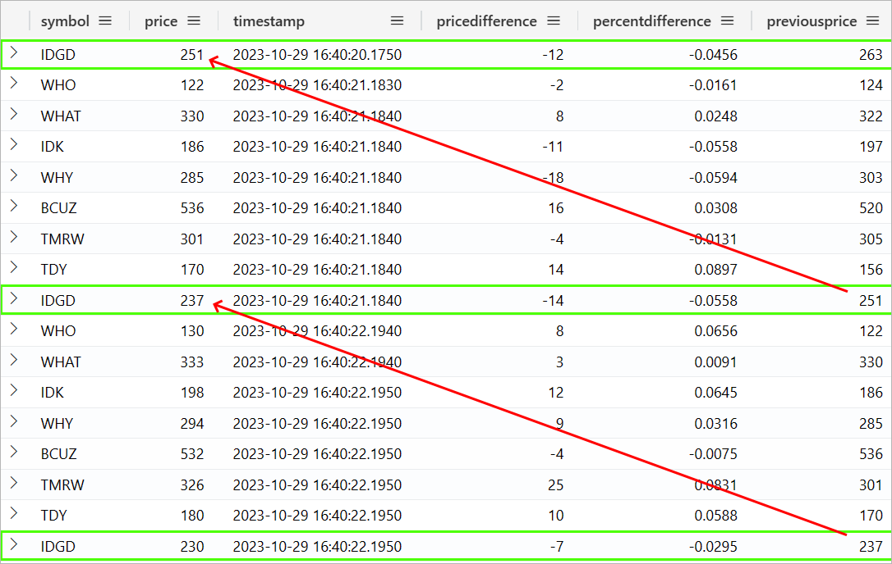
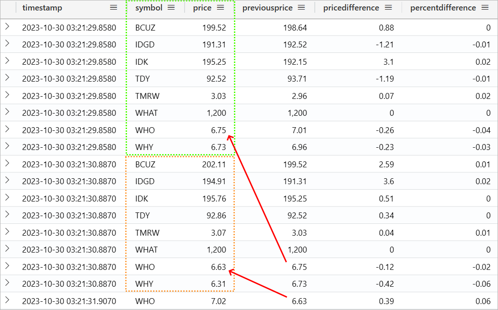

# Module Ex-01 - KQL Queryset Improvements

[< Previous Module](../modules/moduleex00.md) - **[Home](../README.md)** - [Next Module >](./moduleex02.md)

## :stopwatch: Estimated Duration

20 minutes

## :thinking: Prerequisites

- [x] Lab environment deployed from [setup](../modules/module00.md)
- [x] Completed [Module 01](../modules/module01.md)
- [x] Completed [Module 02](../modules/module02.md)
- [x] Completed [Module 03](../modules/module03.md)

## :loudspeaker: Introduction

In this module, we explore the original KQL query used to retrieve stock data. While simple and fast, there are limitations that can be addressed a number of ways, so we'll explore a few of those ideas here.

## Table of Contents

1. [Examine the original query](#1-examine-the-oroginal-query)
2. [Consider a mitigation strategy](#2-consider-a-mitigation-strategy)
3. [Rewrite the KQL](#3-rewrite-the-kql)

## 1. Examine the original query

Recall the original KQL query:

```text
StockPrice
| where timestamp > ago(5m)
| order by timestamp asc, symbol asc
| extend pricedifference = round(price - prev(price, 8), 2)
| extend percentdifference = round(round(price - prev(price, 8), 2) / prev(price, 8), 4)
| serialize previousprice = prev(price,8,0)
```

The original table contains the timestamp, symbol, and price columns. The previous price, and consequently price difference and percent difference, is calculated by looking at the symbol's previous entry, which is 8 rows earlier, as shown in the image below:



Recall, too, that the table order needs to be serialized because we are using the windowing [prev()](https://learn.microsoft.com/en-us/azure/data-explorer/kusto/query/prevfunction) function, although in this instance the *order by* will serialize the results.

So what problems does this present? For starters, the query assumes there are always and only 8 symbols for each timestamp. If we add a new symbol, the query would need to be updated. While our script always generates a stable data stream, realistically we would not want to make the assumption . 

Most noticeably, though, the data may not be received in our expected order. While our event hub has guaranteed consistency, expecting the events are received in alphabetical order (specified in the order by) is fragile. We shouldn't expect the KQL database ingestion from the event hub to be in any particular order. We may even see this issue in a chart, like as shown in this image (specifically, notice the right side of the right chart):


Indeed, we can see this kind of behavior if we rapidly query and catch the results at just the right moment:


As you can see in the results, we've ingested a row (symbol WHO), but missing some other symbols. This has caused our use of the *prev()* function to give us the wrong results temporarily (matching the symbol BCUZ). Alarmingly, this erroniously sees this as a massive price drop, but if we were to query this a moment later, you'd likely see the rows complete.

While our query should be resilient to these situations, the issue is caused because the code writing the events to the event hub are not (nor should they be) in alphabetical order. While we can review the code that generates the data in another module, the python datatable looks like so:

```python
dataTable = [
     ['WHO',  ...] 
    ,['WHAT', ...] 
    ,['IDK',  ...]  
    ,['WHY',  ...]  
    ,['BCUZ', ...] 
    ,['TMRW', ...]  
    ,['TDY',  ...] 
    ,['IDGD', ...]  
    ]
```

Because the code iterates through the datatable, we can see the *WHO* symbol is generated first, then *WHAT*, and so on. 

> :bulb: **Did you know?**
> There is a deliberate order to the stock symbols in the datatable. Do you see it?

Using your own environment, execute the KQL query and/or monitor the Percent Changed chart to see if you notice these anomalies.

## 2. Consider a mitigation strategy

There are many ways we can mitigate this situation. Let's consider several approaches:

1. Change the symbol order of query or generating code to match. 
2. Ignore the last second of data in our KQL query (ie WHERE timestamp < ago(1s)) or in the chart visual.
3. Rewrite the KQL so it doesn't rely on the *prev()* function but still calculates the previous values by matching against the actual symbol.

While #1 might work (or might work nearly all of the time), we don't want to tightly couple the input and output mechanisms. The order can change arbitrarily for different use cases, and even if this did work, the code is fragile to missing data or other similar situations.

Next, #2 will work as a quick band-aid, because it ensures we are trimming any data that is coming in at the moment the data is requested. This keeps the systems loosely coupled, but this solution is equally fragile.

The last solution, #3, is the best approach. Are there any other considerations or approaches?

## 3. Rewrite the KQL

The query will need to be able to match earlier records. In SQL (if you happen to know SQL well), you might recall this can be done via a *correlated subquery*. KQL, fortunately, can handle this several ways, and the most flexible in this case is using a combination of the [partition statement](https://learn.microsoft.com/en-us/azure/data-explorer/kusto/query/partitionoperator) and the [scan operator](https://learn.microsoft.com/en-us/azure/data-explorer/kusto/query/scan-operator). 

In short, the partition operator creates subtables based on the specified key, while the scan operator matches records according to specified predicates. While we only need a very simple rule (match the previous row for each symbol), the scan operator can be very powerful as these steps and predicates can be chained. 

Consider the following KQL query, which will give us the same results as our previous KQL query:

```text
StockPrice
| where timestamp > ago(5m)
| project timestamp, price, symbol
 ,previousprice = 0.00
 ,pricedifference = 0.00
 ,percentdifference = 0.00
| partition hint.strategy=native by symbol
  (
    order by timestamp asc 
    | scan with (step s: true => previousprice = s.price;)
  )
| project timestamp, symbol, price, previousprice
    ,pricedifference = round((price-previousprice),2)
    ,percentdifference = round((price-previousprice)/previousprice,2)
| order by timestamp asc, symbol asc
```

The top part of the query (before the partition statement) retrieves the last 5 minutes of data, and sets up the three variables (previousprice, pricedifference, and percentdifference). The partition statement creates a subtable for each symbol, and because the subtable is ordered by timestamp, the scan operator only needs a single step (reffered to as *s*, but this is arbitrary), matching the most recent price into a variable *previousprice*. We can then project that value with the rest of the data, and calculate the price and percentage change similarly to the original query.

The results look like:



The resulting query is far more resilient to order/data issues, and maintains a loose coupling with the data producer. Naturally, a query like this is more computationally expensive, so we'd want to be cognizant of the amount of data we are querying.

## :books: Resources

* [Intro to KQL](https://learn.microsoft.com/en-us/training/modules/write-first-query-kusto-query-language/)
* [Intro to Kusto Scan Operator](https://learn.microsoft.com/en-us/azure/data-explorer/kusto/query/scan-operator)
* [KQL Partition](https://learn.microsoft.com/en-us/azure/data-explorer/kusto/query/partitionoperator)

## :tada: Summary

In this module, you learned about KQL windowing, partition and scan operators, and how to design more resilient queries for real-time data.

## :white_check_mark: Results

- [x] Developed a new KQL query for use in dashboards.

[Continue >](./moduleex02.md)